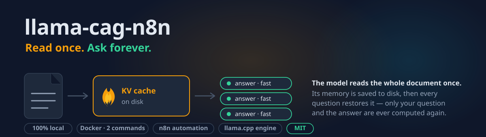
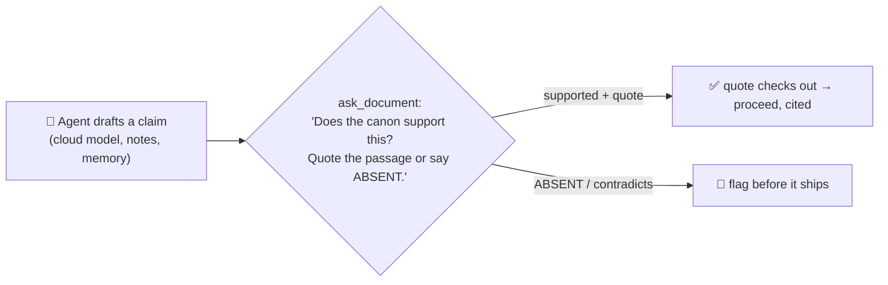
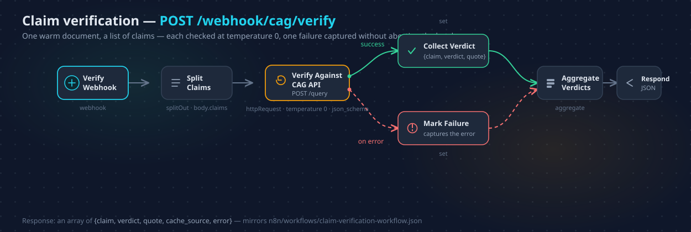
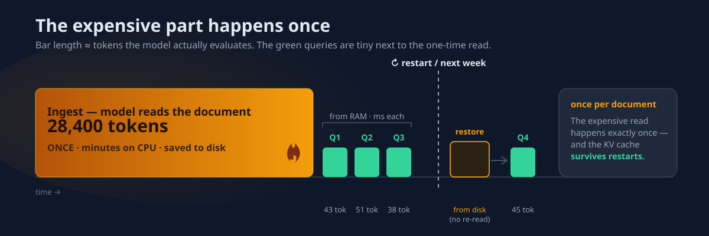
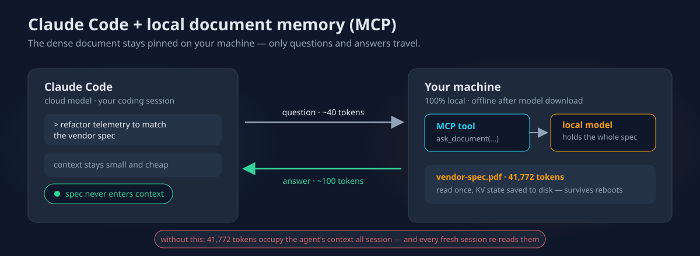
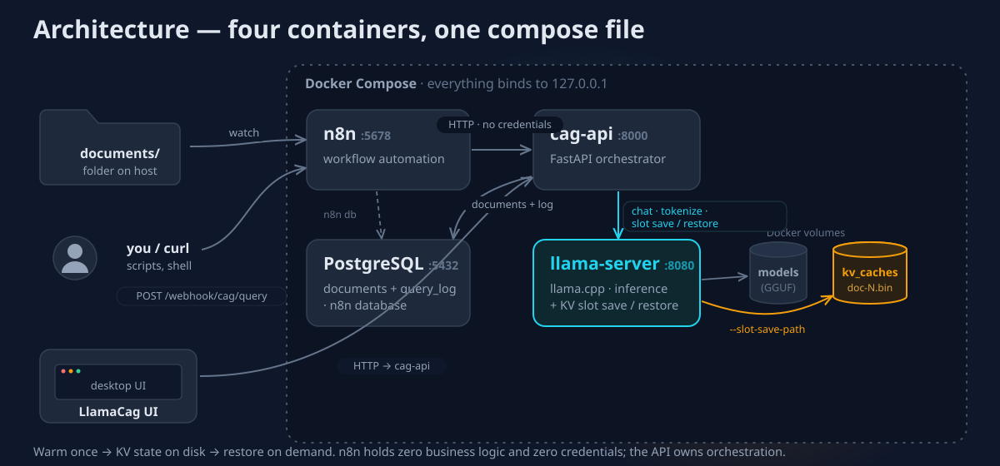
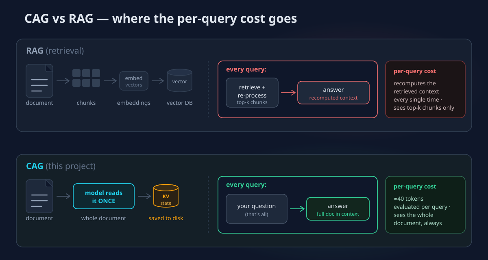

<p align="center">
  
</p>

# llama-cag-n8n

**Ask questions about your documents with a fully local LLM — without the model
re-reading the document every time.**

[](https://github.com/VictorSteinbock/llama-cag-n8n-reworked/actions/workflows/ci.yml)
[](LICENSE)

> **Not technical?** Read **[the two-minute, plain-words version](docs/EXPLAINER.md)**
> — a brilliant reader, a filing clerk, and why reading once beats re-reading forever.
>
> **Nervous about the install?** The **[step-by-step setup guide](docs/SETUP.md)**
> walks it in plain words — or, if you use Claude Code,
> **[let it set everything up for you](docs/SETUP.md#let-claude-code-do-it)**.

You have a document you need to **ask questions of** — a product manual, a
contract, a compliance binder, a vendor spec — and you'll ask it not once but
dozens of times over the coming weeks. Every way of doing that today makes you
give something up:

- **Send it to the cloud:** smart and fast, but your private document leaves the
  building, and you pay for every question — re-reading the whole thing each new
  session.
- **Run a local model the ordinary way:** private and free, but it re-reads the
  entire document from scratch on *every* question — minutes of waiting, every
  single time.
- **Chop it into a vector database (RAG):** quick, but the model only ever sees a
  few retrieved snippets, never the whole document — so it misses whatever lives
  in the connections between pages.

None of those is the thing you actually want, which is simply *a model that has
**read your document** and remembers it.*

**That's what this is.** Hand it a document once; it reads the whole thing a
single time, on your own hardware, and keeps that understanding. Every question
afterward is answered against the **entire** document — in seconds, for free, and
without a byte leaving your machine. **Read once. Ask forever.**

**How, in a sentence:** this is a self-hosted implementation of **Cache-Augmented
Generation (CAG)** — when the model reads your document, its internal state (the
"KV cache") is saved to disk, and every later question *restores* that state
instead of re-reading, so only your question and the answer are ever computed
again. It all runs in Docker —
[llama.cpp's `llama-server`](https://github.com/ggml-org/llama.cpp) for inference
and cache persistence, a small FastAPI orchestrator (`cag-api`),
[n8n](https://n8n.io/) for automation, and PostgreSQL for metadata — on Windows,
macOS, or Linux, with no host compilation and no external APIs.

## Is this for you?

Before the details, here is the whole trade-off in one picture — the situations
this is built for, the ones better served by another tool, and the operating
realities that hold even in the sweet spot:

<p align="center">
  
</p>

If the left column sounds like your problem, the rest of this README is worth
your time. If the right column does, [CAG vs RAG](#cag-vs-rag-honestly) and
[Why not just Open WebUI](#why-not-just-open-webui-or-anythingllm) point you
onward, honestly. New to all this? Start with the
[plain-words explainer](docs/EXPLAINER.md) or the
[setup guide](docs/SETUP.md).

## Where this shines

The mechanism is generic, but it pays off hardest in a specific shape of
problem: **many questions against one dense document that doesn't change.**
Four places that shape shows up.

**A support bot that actually knows the manual.** Narrow-domain help bots built
on a general model hallucinate policy the moment a question leaves the beaten
path — they were never given the source of truth, only a paraphrase of it. Here
the bot's backend is the n8n query webhook, and the model literally holds the
entire product manual or policy document in its KV state, so every answer is
grounded in the actual text. After the one-time warm it's precise and fast, costs
nothing per question, and never sends a word off the machine.

**A token-saver sidecar for cloud coding agents (via MCP).** Give Claude Code a
28k-token spec to work against and it occupies a seventh of a 200k context
window all session — crowding out real work — and while provider-side prompt
caching discounts warm re-sends, those caches are short-lived and still
metered: every fresh session, every post-compaction re-read, pays for the full
spec again. Point the agent at the local `ask_document` MCP tool instead and
only questions (~tens of tokens) and answers cross the boundary. The spec stays
pinned in a local KV cache — never occupying the agent's context, never
expiring, never billed, never leaving your machine.

**The team reference desk.** Contracts, runbooks, compliance manuals, an SOP
binder — documents a team asks the same questions against for weeks, and that
are not allowed to leave the building. This runs entirely on your own hardware,
the caches survive restarts (ask today, ask again after a reboot, no re-warm),
and every answer is grounded in the whole document rather than the top-k chunks a
retriever happened to pull. Private by construction, correct by construction.

**An automation brain inside n8n.** Because querying is a single HTTP call, any
workflow can consult the canonical document as one node: classify an incoming
ticket against the support policy, extract the required fields per the spec,
route an approval by the rulebook. The document is the source of truth and the
workflow just asks it — no embeddings pipeline, no vector store, no glue.

If the shape of your problem is "many questions, one dense document," this is the
cheapest correct setup that runs on your own hardware.

### Loops and living documents

The economics get better the more you loop. **Question sweeps:** because the
marginal question is nearly free, running *hundreds* of questions against one
warm document is a rounding error — a compliance checklist, an extraction
battery, an eval harness. The bundled sweep workflow takes a list and returns
all the answers in one call:

```bash
curl -X POST http://localhost:5678/webhook/cag/sweep \
  -H "Content-Type: application/json" \
  -d '{"questions": ["What is the max load?", "Who signs off?", "Renewal date?"]}'
```

**Living documents:** re-drop a changed file into the watch folder and the hash
dedupe sorts it out — unchanged re-drops are free no-ops, changed versions
re-warm automatically, and the query webhook always answers against the latest
cached state. Point a nightly export at the folder and you have a self-updating
document memory. **Agent loops:** via MCP (or `history` on `/query`), an agent
can interrogate a pinned document iteratively — plan, ask, refine, ask again —
while only the questions and answers ever occupy the agent's own context.

**Scaling up:** all of this multiplies with RAM. A 128 GB unified-memory machine
(or a 256–512 GB Mac Studio) holds a whole shelf of 100k-token documents hot in
parallel slots — see [docs/HARDWARE.md](docs/HARDWARE.md) for per-tier model
recommendations, `.env` presets, and the native-Mac (Metal) recipe.

## The grounding oracle — check any AI against your rulebook

The sharpest use is **the grounding oracle**: a reproducible, source-grounded
fact-checker. At `temperature 0` with the built-in rule ("answer only from the
document; say so if absent"), the pinned canon becomes a verifier that is
*reproducible* — same claim + same document → same verdict, every time — and
that must **cite the passage it relied on**, so invented support shows up as a
quote you can check instead of hiding in fluent prose.



A cloud agent drafts; one cheap local call checks the draft against the source
of truth *before it ships*. The verdict is machine-readable — a claim in, a
`{claim, verdict, quote, conditions, quote_grounded}` object out — and
[`POST /verify`](#the-api) goes one step further: it **mechanically** confirms the
returned quote actually occurs in the source bytes and reports `quote_grounded`,
so a fabricated citation is caught with **zero** extra model calls. The bundled
**claim-verification workflow** batch-verifies a whole list that way in one
call — each claim checked at `temperature 0` against the pinned document, one
bad claim captured without aborting the rest:

```bash
curl -X POST http://localhost:5678/webhook/cag/verify \
  -H "Content-Type: application/json" \
  -d '{"claims": ["The peak current limit is 12 A.",
                  "Widgets are refundable within 30 days."]}'
# → [{"claim": "…", "verdict": "supported",    "quote": "…", "quote_grounded": true, "conditions": ""},
#    {"claim": "…", "verdict": "contradicted", "quote": "…", "quote_grounded": true, "conditions": "only if defective"}]
```

This closes a **productized critique loop**: a drafting agent (Claude Code, or
any model) emits claims → the verify webhook checks each against the canon →
the agent refines the ones that come back `absent` or `contradicted`, before
anything ships.

**What it guarantees — and what it doesn't.** The verdict is *reproducible* and
*source-grounded*: the model always has the whole document in context (no
retrieval miss) and must quote its evidence, and `POST /verify` **mechanically**
checks that quote against the source — so a fabricated citation is caught
automatically (`quote_grounded: false`), no extra model call. But grounding is
**asymmetric**: it hardens `supported`/`contradicted` (there is a passage to
check) but **cannot** harden `absent` (`quote_grounded: null`), and it verifies
the quote's *existence*, not the claim's *entailment* — the model can still
misread real evidence. Treat it as a **fail-safe gate**: auto-pass only on
`supported` with a grounded quote; route `absent` and `contradicted` to review.
And you don't have to guess how reliable the oracle is on a given document —
**calibrate** it (below).

### Know your canon's reliability

`absent` is the honest weak spot: on a long document a model can miss a fact
that *is* there (lost-in-the-middle) and answer `absent`. Instead of guessing
that rate, measure it. `POST /documents/{id}/calibrate` runs a known-answer Q/A
battery against the document at `temperature 0` and scores each answer:

```bash
curl -X POST http://localhost:8000/documents/7/calibrate \
  -H "Content-Type: application/json" \
  -d '{"qa": [{"question": "What is the peak current limit?", "expected": "12 A"},
              {"question": "When does thermal shutdown trigger?", "expected": "150 C"}]}'
# → {"document": {...}, "n": 2, "correct": 2, "accuracy": 1.0, "strict": false, "misses": []}
```

`accuracy` ≈ 1 − the expected miss rate for that battery, so you can pick a safe
operating point (a smaller canon, a bigger model) *before* you rely on it, and
`misses` shows exactly what the model got wrong. The ground truth is yours, so
this measures **this canon under this model** — not the model in general. The
bundled `calibration` workflow wraps the same call for non-technical operators.

### Gating a support bot's answers

For a support bot the question already exists, so the right architecture is
**answer-compare**, not decompose-and-verify. Splitting a draft into atomic
claims and checking each verifies isolated facts but can pass a draft whose facts
are individually true yet whose *conclusion* is wrong. Answer-compare skips the
decomposition entirely: regenerate the grounded answer fresh (`temperature 0`),
then have `/verify` confirm the draft against the source — one grounded
generation, checking the thing that actually ships. The **fail-safe rule** holds:
auto-pass **only** on `supported` with a grounded quote; a non-supported verdict,
a fabricated quote, or any API error all route to human review.

```bash
curl -X POST http://localhost:5678/webhook/cag/answer-gate \
  -H "Content-Type: application/json" \
  -d '{"document_id": 7,
       "question": "Does the warranty cover water damage?",
       "draft": "Yes — the warranty fully covers water damage."}'
# → {"pass": false, "verdict": "contradicted", "reason": "Escalated: ...", ...}
```

The bundled `answer-gate` workflow implements exactly this — one webhook, no
credentials, fail-closed on any error.

### It composes with LLM wikis and second brains

Karpathy's **LLM Wiki** pattern (April 2026) argues that knowledge should
*compound*: sources get read once and integrated into an interlinked,
AI-maintained wiki, instead of being rediscovered by retrieval on every query —
"the wiki is the product, the chat is just the interface." Notice what that
pattern *produces*: one dense, curated, self-consistent canonical document.
**That is exactly the input shape this stack exists to serve.** The wiki (or
your second brain — an Obsidian vault digest, a research corpus summary) goes
in the watch folder; from then on it is pinned, whole, in local KV state. The
two patterns compose cleanly: the wiki layer *curates* knowledge, this layer
*serves* it — read once, ask forever, updated automatically on re-drop.

It also genuinely **enhances** the wiki pattern in two ways. First, coherence:
a wiki's defining feature is its cross-references — and retrieval breaks them
by fetching one page at a time, while whole-document context sees every page
and every link *simultaneously* on every answer. Second, economics: the
compounding knowledge stops re-entering anyone's context window; agents consult
it as a tool (MCP) instead of carrying it.

Second brains and LLM wikis organize knowledge — this gives them teeth: the
knowledge stops being something the model vaguely remembers and becomes
something it must consult, and can be caught deviating from.

<p align="center">
  
</p>

The bundled verification workflow, as imported into n8n — seven of these ship in `n8n/workflows/`.

## What it's actually like to run

No mystery about where your things go or what this does to your computer. In
plain words:

**Where everything lives — all on your machine.**

- Your **documents** stay in a normal folder you control (`./documents`), or you
  upload them in the web UI. They are never sent anywhere.
- The model's **memory** of each document is a cache file on your disk — one file
  per document. That file is what lets it skip re-reading after a restart.
- The **AI model itself** is one large file (~6.5 GB) downloaded once into a
  private Docker volume; after that it runs with the internet switched off.
- A small database on your disk keeps the records — which documents exist, what
  was asked. None of this is in the cloud. *(The [Architecture](#architecture)
  diagram shows all four pieces.)*

**What it uses while running.** One steady cost, and the rest is quiet. Stack on
but idle: it holds the model plus a fixed block of memory (sized by your
settings) — flat, forever. Your CPU only works hard for one thing — the **first**
time it reads each new document (minutes) — and every question after that is a
brief blip. Adding more documents costs a little disk each and **no** extra
memory. *(The full [resource story](#resource-anatomy--what-uses-what-when) is
under the hood.)*

**Switching models is safe now — this used to be the trap.** Home-grown versions
of this idea had a nasty footgun: a saved memory was tied to the exact model that
produced it, and loading it under a *different* model could silently hand you
corrupt answers, with no warning. **This rebuild closes that hole for you.** It
stamps each set of caches with a fingerprint of the model that made them; the
moment you switch models (or even quant levels), it notices the mismatch and
throws the stale memories away automatically — you *cannot* accidentally read one
model's memory with another model. The only thing you'll notice is that right
after a switch, the first question about each document is slow again (it re-reads,
once), then fast forever. **Nothing here is yours to manage by hand:** the old
warm-up / basic / fallback modes are gone, replaced by one automatic policy that
runs the whole time. *(Specifics in
[Updating & maintenance](#updating--maintenance) and
[Choosing a model](#choosing-a-model-state-of-play-mid-2026).)*

## Quick start

**Prerequisites:** [Docker Desktop](https://www.docker.com/products/docker-desktop/)
(or docker + compose v2) and Python 3.10+.

```bash
git clone https://github.com/VictorSteinbock/llama-cag-n8n-reworked.git
cd llama-cag-n8n-reworked

python llamacag.py setup     # writes .env with generated secrets
python llamacag.py start     # builds + starts the stack
```

First boot downloads the default model (Gemma 4 12B QAT, ~6.5 GB) from Hugging
Face into a Docker volume; after that everything runs offline. Watch progress
with `python llamacag.py logs llama-server`, and confirm readiness with
`python llamacag.py status`.

**Set up n8n (one-time, ~2 minutes):**

1. Open http://localhost:5678 and create the local owner account.
2. Import the seven workflows from [`n8n/workflows/`](n8n/workflows/)
   (*Workflows → ⋯ → Import from file*). Upgrading an existing deployment? Re-import
   `claim-verification-workflow.json` (now backed by `/verify`) and import the new
   `answer-gate-workflow.json`.
3. Activate each one. **No credentials to configure** — the workflows only call
   `cag-api` over the internal Docker network.

**Use it:**

```bash
# 1. Make a document queryable (or just drop a file into ./documents/)
curl -X POST http://localhost:8000/documents -F "file=@manual.pdf"

# 2. Ask questions — via n8n's webhook…
curl -X POST http://localhost:5678/webhook/cag/query \
  -H "Content-Type: application/json" \
  -d '{"question": "What are the safety limits in section 4?"}'

# …or directly, or with the helper:
python llamacag.py query "What are the safety limits in section 4?"
```

The response includes `timings.cache_source` (`memory` / `disk` / `recomputed`)
and how many prompt tokens were actually evaluated — after the first query
that number should be tiny.

**…or open the web UI:**

Nothing to install — once the stack is up, open **http://localhost:8000/ui** in a
browser. Drag in a document, chat with it (with the cache-source chip and token
receipt), verify a list of claims, and see which documents are Hot / on Disk /
Cold. It's a pure same-origin client of the endpoints above.

No documents yet? The empty state offers **Try a sample** — one click ingests a
bundled sample from [`samples/`](samples/) and drops you into Chat. Load the
refund policy, then paste *"Widgets are refundable within 30 days"* into **Verify**
to watch the oracle catch the condition.

> **Security boundary.** The stack is **unauthenticated by design; loopback is
> the security boundary.** The web UI is for the **local host**. Reaching it from
> another machine means binding the API port beyond `127.0.0.1`, which exposes an
> **unauthenticated API on your network** — only do that behind an authenticating
> reverse proxy, or on a trusted LAN. Set `WEBUI_ENABLED=false` to turn the
> browser surface off entirely. General multi-user access is a separate roadmap
> item (F8), not this feature.

## The economics — the receipt

Every answer comes with a receipt. Here is what it looks like when a
28,400-token manual costs 43 tokens of actual compute:

<p align="center">
  
</p>

The expensive part — the model reading the whole document — happens **exactly
once per document**, and the resulting KV cache survives restarts. Ingesting a
28k-token manual takes minutes on CPU; every question after that evaluates only
a few dozen tokens. The `/query` response proves it in the `timings` block —
after the first query, `prompt_tokens_evaluated` collapses to your question's
length while `cache_source` reports where the state came from:

```jsonc
// POST /query {"question": "What are the safety limits in section 4?"}
{
  "answer": "Section 4 caps continuous load at 8 A and peak at 12 A for 10 s …",
  "document": { "id": 7, "file_name": "manual.pdf", "n_tokens": 28400 },
  "duration_ms": 640,
  "timings": {
    "prompt_tokens_evaluated": 43,      // just the question — not the 28,400-token doc
    "prompt_tokens_from_cache": 28400,  // the whole document, reused from the KV cache
    "answer_tokens": 96,
    "cache_source": "memory"            // "memory" hot · "disk" restored · "recomputed" self-heal
  }
}
```

The very first query on a document (or the first after `cache_source: "disk"`
following a restart) evaluates the full prefix once; from then on it's tens of
tokens. **Numbers, not adjectives — that's the whole point.** (The JSON above
is an illustrative response — the *shape* is guaranteed by the mechanism, and
your own first query prints the real receipt.)

## Use it from Claude Code (MCP)

The `mcp/` package (`cag-mcp`) exposes the stack to any [MCP](https://modelcontextprotocol.io)
client — Claude Code, Claude Desktop, or any 2026 agent — as a local
document-memory tool. Instead of pasting a dense spec into the agent's context on
every task and paying to re-read it each turn, the agent calls the `ask_document`
tool: only the question and the answer cross the boundary, while the document
stays pinned in a local KV cache the cloud model never has to carry. It's a thin
stdio server (`python -m cag_mcp`) that just forwards to `cag-api` at
`CAG_API_URL` (default `http://localhost:8000`), and it offers five tools —
`list_documents`, `ask_document`, `verify` (the
[grounding oracle](#the-grounding-oracle--check-any-ai-against-your-rulebook) as
an agent tool), `ingest_text`, and `ingest_file`.

Register it with Claude Code (`pip install -e ./mcp` first, in the stack repo):

```bash
claude mcp add cag -- python -m cag_mcp
```

…or add it to a project's `.mcp.json`:

```jsonc
{
  "mcpServers": {
    "cag": {
      "command": "python",
      "args": ["-m", "cag_mcp"],
      "env": { "CAG_API_URL": "http://localhost:8000" }
    }
  }
}
```

<p align="center">
  
</p>

**What a real coding session looks like.** You ingested the vendor spec once
(dropped it in the watch folder); now, mid-refactor, Claude Code consults it as
a tool instead of carrying it:

<p align="center">
  
</p>

Simulated session — run it yourself for the live version.

```text
> refactor the telemetry module to comply with the vendor spec

⏺ I'll check the spec's exact requirements before touching the code.

⏺ cag - ask_document (MCP)
  question: "What payload fields, types and units does the vendor require
             for telemetry events, and what timestamp format?"
  ⎿ Events require device_id (string), ts_utc (ISO-8601 with milliseconds),
    seq (monotonic int) and readings[] using unit-suffixed keys — temp_c,
    load_pct, volt_mv. Unknown keys are rejected, not ignored (§4.2).
    [doc 3 vendor-spec.pdf · cache: memory · evaluated 38 of 41,772 prompt tokens · 590 ms]

⏺ Unit-suffixed keys with strict rejection — renaming the fields in
  telemetry.py and adding a schema guard…
```

The 41,772-token spec was evaluated **once**, weeks ago, on your hardware. This
turn cost the cloud model ~40 tokens of question and ~100 of answer (plus a few
hundred tokens of tool definitions, once per session — honesty in accounting).
The spec itself never occupies the agent's context: not this session, not after
compaction, not next month. The same shape works as
a **second brain**: pin your notes, your research corpus digest, or a project's
design doc, and any MCP-capable agent — coding or otherwise — gets a private,
grounded, queryable memory that never inflates its context and never leaves
your machine.

## Running it as a dedicated chatbot

The original motivation for this project — a narrow-domain support bot — is a
configuration, not a fork. Two things matter:

**Retrieval is not a dial here.** The model *always* has the entire document in
context — there is no top-k retrieval step that can miss. What `temperature`
controls is only the **wording** of the generated answer:

- **Razor-sharp extractive mode** (support/compliance bots): send
  `"temperature": 0` per request — or set it stack-wide with
  `DEFAULT_TEMPERATURE=0.0` in `.env` — for deterministic, quote-like answers.
  Same question → same answer, every time.
- **Hybrid mode** (assistant-style): the default (`0.2`) keeps answers grounded
  but lets the model synthesize and phrase naturally across the whole document —
  full context *plus* room to compose. Raise toward `0.7` only if you want
  looser prose; grounding still comes from the system rule.

**The guardrail is the system prompt**, not luck: every query is wrapped in
*"answer using only the information in the document; if it's not there, say so
plainly"* (the `SYSTEM_TEMPLATE` constant in `api/app/cag.py` — edit it there
if your bot needs a persona or a refusal style, then rebuild; existing caches
re-warm themselves on next use). Wire your bot's frontend to the n8n webhook
(`POST /webhook/cag/query`, with `history` for multi-turn), cap
`DEFAULT_MAX_ANSWER_TOKENS` if you want terse replies, and that's the whole
deployment.

## The API

Interactive docs at http://localhost:8000/docs.

| Endpoint | What it does |
|----------|--------------|
| `POST /documents` | Multipart file upload (`.txt` `.md` `.html` text-based `.pdf`) → extract, token-count, warm the KV cache, persist it. Uploads are capped at `MAX_UPLOAD_MB` (default 50 MB) → `413` if exceeded |
| `POST /documents/text` | Same for raw text: `{"text": "...", "file_name": "notes.txt"}` |
| `GET /documents` | Registry with status, token counts, usage |
| `DELETE /documents/{id}` | Remove document + its cache file |
| `POST /query` | `{"question": "...", "document_id"?: n, "max_tokens"?: n, "temperature"?: x, "history"?: [{role, content}, …], "json_schema"?: {…}}` — no `document_id` means the most recently cached document; `history` enables multi-turn chat (earlier turns stay KV-cached, so each round only evaluates the newest exchange); `json_schema` constrains the answer to valid JSON matching that schema (see [Structured output](#structured-output)) |
| `POST /verify` | `{"claim": "...", "document_id"?: n, "max_tokens"?: n}` → a grounded verdict `{claim, verdict, quote, conditions, quote_grounded, match_ratio, grounding_method, …}`. Runs one `temperature 0` check and **mechanically** confirms the quote occurs in the source (`quote_grounded`) — a fabricated citation is caught with no extra model call. Tune strictness with `QUOTE_MATCH_THRESHOLD`. See [the grounding oracle](#the-grounding-oracle--check-any-ai-against-your-rulebook) |
| `POST /documents/{id}/calibrate` | `{"qa": [{"question", "expected"}, …], "strict"?: bool}` → runs the known-answer battery at `temperature 0` and scores each answer: `{n, correct, accuracy, misses, strict, document}`. `accuracy` ≈ 1 − the expected miss rate for *this* canon under *this* model; `misses` shows what it got wrong. Capped at `CALIBRATE_MAX_ITEMS` (default 100) → `422`. See [Know your canon's reliability](#know-your-canons-reliability) |
| `GET /stats` | Usage over the query log in three windows (`24h` / `7d` / `all`) — tokens evaluated vs. reused and the `reuse_ratio` — plus an optional cost-savings estimate (set `CLOUD_PRICE_PER_1K_INPUT` to your provider's input price to enable the money line). Lock-free, so it answers even mid-generation |
| `POST /maintenance` | Reconcile disk ↔ DB: delete orphaned caches, report missing ones, disk usage |
| `GET /health` | 200 healthy / 503 degraded, with per-dependency detail |

Duplicate content (same SHA-256) is detected and never re-warmed. A document
that doesn't fit the context window is rejected at ingest with a `413` telling
you the measured token count and which knob to raise.

### Structured output

Pass a `json_schema` (a JSON Schema object) on `/query` and the answer is
**guaranteed to be valid JSON matching that schema** — llama-server
grammar-samples the completion, so you can parse the reply directly with no
regex or retry loop. It constrains sampling only: the cached document prefix is
byte-identical to any other query, so a schema-constrained answer is exactly as
cheap. This is what makes the [grounding oracle](#the-grounding-oracle--check-any-ai-against-your-rulebook)
above a *typed* verifier — a claim in, a machine-readable verdict out:

```bash
curl -X POST http://localhost:8000/query \
  -H "Content-Type: application/json" \
  -d '{
        "question": "Verify strictly against the document: \"The peak current limit is 12 A\". Give your verdict and the exact supporting or contradicting passage.",
        "temperature": 0,
        "json_schema": {
          "type": "object",
          "properties": {
            "claim":   { "type": "string" },
            "verdict": { "enum": ["supported", "absent", "contradicted"] },
            "quote":   { "type": "string" }
          },
          "required": ["claim", "verdict", "quote"]
        }
      }'
# → {"answer": "{\"claim\":\"The peak current limit is 12 A\",\"verdict\":\"supported\",\"quote\":\"…peak at 12 A for 10 s\"}", …}
```

### Preparing documents (PDFs, scans, tables)

Ingestion reads **text**. A `.txt`, `.md`, or `.html` file, or a PDF with a real
text layer, extracts cleanly. What does *not* survive plain extraction:

- **Scanned / image-only PDFs** — there is no text to pull, so ingest returns
  `415` (OCR is deliberately out of scope for the request path).
- **Charts, graphs, diagrams** — a bar chart's meaning lives in pixels; text
  extraction drops it silently.
- **Complex tables / multi-column layouts** — `pypdf` often mangles column
  order, so a "successful" extraction can still be quietly wrong.

The stack trusts its extracted text as ground truth, so **garbage extraction
means confidently wrong grounding** — the one failure no downstream safeguard
can catch. The fix is to prepare rich documents *before* ingesting, with the
bundled CLI:

```bash
python llamacag.py prepare path/to/report.pdf
# text-layer PDF → extracted offline, no converter, nothing leaves your machine
# scanned/chart PDF → uses your configured PREPARE_CMD (see below)
# → writes ./prepared/report.md — review it, then move it into ./documents to ingest
```

A PDF with a real text layer is extracted **offline** with no converter. Only
scanned / image / chart-heavy PDFs need a converter, set once in `.env` as
`PREPARE_CMD` (a template where `{in}`/`{out}` are substituted as whole
arguments — no shell). Pick by your privacy needs:

- **Local, private** — `marker` (`pip install marker-pdf`), `docling`, or a local
  vision model. The document never leaves your machine.
- **Cloud vision model** — faster and often higher quality, **but the document is
  sent to a third party**; don't use it for confidential material.

Prepared files land in `./prepared` (a **staging** folder, not the watch folder)
so you **eyeball the `.md` before trusting the grounding**, then move it into
`./documents` to ingest. Re-running `prepare` on a revised conversion ingests as
a **new** document (dedupe is by content hash, not file name) — the old row and
its KV cache linger and untargeted queries jump to the newest, so delete the
superseded id and pass `document_id` explicitly while iterating.

This is a deliberate boundary — **cag-api ingests text; turning a visual PDF into
faithful text is a separate preprocessing step**, kept out of the request path
(which stays shell-free by design; the converter runs only in this CLI, as a list
argv, never a shell string).

## Choosing a model (state of play, mid-2026)

Set `LLAMA_MODEL` in `.env` to any GGUF on Hugging Face (`repo[:quant]`),
then `python llamacag.py stop && python llamacag.py start`:

| Model | Context | Download | Fits comfortably in | Notes |
|-------|---------|----------|---------------------|-------|
| `google/gemma-4-12B-it-qat-q4_0-gguf` *(default)* | 262k | 6.5 GB | 16 GB RAM | Google's official QAT build — Q4 with near-full quality, Apache 2.0 |
| `google/gemma-4-E4B-it-qat-q4_0-gguf` | 128k+ | ~3 GB | 8 GB RAM | Edge-class Gemma 4, lightest sensible option |
| `unsloth/Qwen3.5-9B-GGUF:Q4_K_M` | 256k+ | ~5.5 GB | 16 GB RAM | Strongest small dense alternative |
| `google/gemma-4-26B-A4B-it-qat-q4_0-gguf` | 256k | ~15 GB | 32 GB RAM | MoE: 26B-class answers at ~4B-active speed — best quality-per-second on big-RAM CPU boxes |
| `ggml-org/GLM-4.7-Flash-GGUF:Q4_K` | 202k | ~27 GB | 64 GB RAM | Workstation class |

Two knobs matter alongside the model:

- **`LLAMA_CTX_SIZE`** (default **65536**) — total context, split across slots;
  each document must fit `ctx ÷ slots − 1120` (1024 answer + 96 prompt
  head-room). KV memory scales with it, but **`LLAMA_CACHE_TYPE_KV=q8_0`**
  (the default) halves that at negligible quality cost — this is why 64k is
  now an affordable default.
- **`CAG_SLOTS`** (default **1**) — how many documents stay *hot in RAM* at
  once. With 2–4 slots, alternating between documents never touches disk;
  llama-server divides the context between them. Slots parallelize
  *residency*, not generation: all inference is serialized through the
  engine, so a long warm (minutes for a big document) delays queries on
  other slots — ingest big documents via the watch folder off-peak if that
  matters.

**Changing model or quant invalidates existing caches**; they self-heal
(recompute + re-save) on their next query. cag-api enforces this itself: it
fingerprints the served model (llama-server's `/props` `model_path`) in a
`model.marker` file next to the caches and wipes stale `*.bin` files once on
mismatch — necessary because llama.cpp validates restored state files only
*structurally*, so a same-shaped model switch (different weight quant, a
fine-tune) would otherwise restore silently.

### GPU & native acceleration

To be clear about intent: **CPU is the universal floor, not the design point.**
The stack runs anywhere Docker does, but the fast path — and the original
design target — is accelerated inference: Metal on Apple Silicon (unified
memory is ideal for CAG, since model *and* KV caches share one big pool), CUDA
on NVIDIA, Vulkan on Intel/AMD. Pick your lane:

- **Apple Silicon (Metal):** Docker Desktop on macOS has **no GPU passthrough**,
  so run llama-server natively (`brew install llama.cpp`) and keep the rest of
  the stack in Docker: `python llamacag.py start --native-llama` prints the
  exact host command and the two `.env` lines that point `cag-api` at it. Full
  recipe in [docs/HARDWARE.md](docs/HARDWARE.md).

- **NVIDIA:** `python llamacag.py start --gpu` (CUDA image; NVIDIA Container
  Toolkit required — bundled with Docker Desktop on Windows).
- **Intel Arc / AMD:** `python llamacag.py start --vulkan` — passes `/dev/dri`
  through, so it works on **Linux hosts**. Docker Desktop's VM has no `/dev/dri`;
  on Windows laptops (including Intel Arc iGPUs) run the CPU stack — a modern
  multi-core CPU handles the 4–12B class fine, and CAG means the expensive
  prompt processing happens only once per document anyway.

## Configuration

Everything lives in `.env` (created by `setup`; see [.env.example](.env.example)
for all knobs and comments). The defaults are sensible; the ones you might touch:

| Variable | Default | |
|----------|---------|---|
| `LLAMA_MODEL` | `google/gemma-4-12B-it-qat-q4_0-gguf` | Model to download & serve |
| `LLAMA_CTX_SIZE` | `65536` | Total context (split across slots) |
| `CAG_SLOTS` | `1` | Documents kept hot in RAM simultaneously (residency only — generation stays serialized) |
| `LLAMA_CACHE_TYPE_KV` | `q8_0` | KV cache precision (`f16` to disable quantization) |
| `LLAMA_EXTRA_ARGS` | — | Extra llama-server flags, e.g. `--cache-reuse 256` |
| `DOCUMENTS_FOLDER` | `./documents` | Folder watched by the ingestion workflow |
| `GENERIC_TIMEZONE` | `UTC` | Used by n8n schedules |
| `WEBUI_ENABLED` | `true` | Serve the zero-install web UI at `/ui` (loopback only) |
| `PREPARE_CMD` | — | Converter template for `prepare` on scanned/visual PDFs (`{in}`/`{out}` substituted as whole args, no shell) |
| `CLOUD_PRICE_PER_1K_INPUT` | `0.0` | Your cloud provider's input $/1k tokens — enables the `/stats` savings line |
| `N8N_PORT` / `CAG_API_PORT` / `LLAMA_PORT` / `DB_PORT` | `5678/8000/8080/5432` | All bound to `127.0.0.1` |

## Under the hood

Everything below is the machinery; nothing here is required reading to use the stack.

### Cache states and latency — the behaviour model

Earlier versions made you choose between hand-managed modes (warm-up, basic,
fallback, disabled). v2 has **one automatic policy** and three observable
states — and every answer's `timings.cache_source` tells you which one served it:

| State | When it happens | Added latency | Memory effect |
|-------|-----------------|---------------|---------------|
| `memory` — hot in a slot | The document was ingested or queried recently; up to `CAG_SLOTS` documents stay hot at once (least-recently-used gets evicted) | **None** — only your question and the answer are computed | Uses the slot's share of the fixed KV pool |
| `disk` — restored | First query on a document after a restart or eviction | **Seconds** — the saved KV state is read from disk; the text is *not* re-processed | Loads into a slot (evicting the LRU document if all slots are busy) |
| `recomputed` — self-heal | Cache file missing or invalidated (e.g. you switched models) | The one-time full read, **once** — then it re-saves itself and is fast again | Same as a fresh warm |

**Sizing against slot thrash:** if concurrent consumers alternate between more
documents than `CAG_SLOTS`, every switch evicts a hot document and restores
another from disk — so size `CAG_SLOTS` to at least the number of documents in
active rotation, and each still gets `LLAMA_CTX_SIZE ÷ CAG_SLOTS` of context.
Note that slots parallelize *residency*, not generation: all inference is
serialized through the engine, so a long warm on one slot delays queries on
the others — ingest big documents off-peak if that matters.

Three strategy decisions are baked in, so there is nothing to manage:

- **Warm-at-ingest.** The expensive read happens when a document is *added*
  (ingest returns only after the cache is saved to disk) — so the first
  question is never the slow one. Latency is paid where you expect it: at drop
  time, visibly, once.
- **Always-warm server.** v1's "warm-up mode" (a persistent model instance held
  in RAM) is simply how llama-server always runs now — generalized to
  `CAG_SLOTS` simultaneous hot documents. And v1's 8,000-character fallback
  mode — the silent truncator behind "spotty" answers — is gone entirely:
  there is no degraded path, only the three honest states above.
- **Fresh context by default.** A `/query` without `history` is a clean-room
  question against the document; pass `history` when you *want* a conversation.

### Resource anatomy — what uses what, when

If earlier CAG experiments left you wary of mystery memory pressure, here is
the whole resource story. There is exactly **one big constant** and everything
else is a burst:

| What's happening | Compute (CPU/GPU) | Memory | Disk |
|---|---|---|---|
| **Stack up, idle** | ~zero | **The constant:** model weights (~6.5 GB default) + the fixed KV pool — allocated once at startup, flat forever after | — |
| Ingest / warm a document | Sustained — the one real workload (minutes on CPU, far less accelerated) | No change (the pool already exists) | One write burst: the cache file |
| Question on a hot document | Brief burst (question + answer tokens only) | No change | — |
| First question after restart | ~none — no re-processing | No change | One read burst (cache file → pool) |
| Self-heal (lost/invalid cache) | One ingest-worth, once | No change | Rewrites the cache file |
| **Adding more documents** | — | **No change — ever** | +1 file each (`cache_bytes` in the nightly report) |
| Switching models | — | New constant after restart | One-time download; old caches sit stale until re-warm or cleanup |

**The pressure knob is the pool, and you own it:** pool size ≈
`LLAMA_CTX_SIZE` × slots' KV cost — halved already by the default `q8_0`
quantization, and scaled by your model choice. Too much pressure → lower
`LLAMA_CTX_SIZE`, pick a smaller model, or keep `CAG_SLOTS=1`
([docs/HARDWARE.md](docs/HARDWARE.md) has the arithmetic per tier). With GPU
offload the weights and pool live in VRAM instead (`--gpu-layers`); on unified
memory (Apple/Strix Halo) it's all one pool — which is why those machines are
this architecture's natural home.

**And it's observable, not asserted:** `python llamacag.py status` now prints
live per-service CPU/RAM; `GET /stats` reports token reuse and an estimated
cost-savings figure across three time windows; llama-server's startup log states
its exact weights/KV allocations (`python llamacag.py logs llama-server`); the
nightly maintenance report tracks cache disk. Contrast with v1, which loaded the model
*and* whole pickled cache states inside the desktop app's own process — RAM
pressure that grew with use and answered to nothing. v2's footprint is one
predictable allocation in one container, tunable from `.env`, with documents
scaling on disk.

### Architecture

<p align="center">
  
</p>

Four containers, one compose file, everything bound to `127.0.0.1`. **n8n**
watches a folder and exposes a query webhook; **cag-api** owns all
orchestration (registry, slot assignment, self-healing); **llama-server** does
inference and persists KV state to the `kv_caches` volume via `--slot-save-path`;
**PostgreSQL** holds document metadata and the query log. n8n carries zero
business logic and zero credentials — it only calls `cag-api` over the internal
Docker network. The full sequence diagrams (warm and query paths) are in
[docs/ARCHITECTURE.md](docs/ARCHITECTURE.md).

## CAG vs RAG, honestly

<p align="center">
  
</p>

| | RAG | CAG (this project) |
|---|---|---|
| Document handling | chunk → embed → vector DB → retrieve per query | model reads the whole document once, state cached |
| Per-query cost | retrieval + re-processing of retrieved chunks | question + answer tokens only |
| Answer context | top-k chunks | the entire document, always |
| Corpus size | effectively unlimited | **must fit the context window** — that's the trade-off |

If your knowledge base is a handful of manuals, contracts, or specs (up to
~100k tokens each with the default model), CAG is simpler and often more
accurate — the model always sees the *entire* document, not retrieved chunks.
If it's ten thousand documents, you want RAG — and a different repo.

## Why not just Open WebUI or AnythingLLM?

Because they solve a different problem, and this fills a gap none of them do.

**They own retrieval.** AnythingLLM, Open WebUI, and LibreChat are excellent
self-hosted chat UIs with document workspaces — but they are all **RAG systems**
(chunk → embed → vector DB → retrieve per query). They shine on big corpora and
multi-user setups, and they approximate by design: the model sees retrieved
chunks, not the whole document. LM Studio / Ollama / Jan make running a local
model easy and cache prompts in RAM per session, but nothing is document-pinned
and nothing survives a restart.

**This owns exact, persistent whole-document memory.** Feed it a document once;
the model's internal state (KV cache) is persisted to disk. Every question
afterwards — today, tomorrow, after a reboot — skips re-reading and evaluates
only your question, against the *entire* document. Persistent KV-cache reuse is
productized in the cloud (Anthropic/OpenAI/Gemini prompt caching) and active in
research, but **no mainstream self-hosted tool ships it as a feature.** It's also
automation-first: the n8n layer turns folder-drop and a webhook into the primary
interface, not an afterthought.

**Use one of them instead if** you have thousand-document knowledge bases (that's
retrieval territory), documents bigger than the context window, or a team that
needs multi-user auth. This project is **for** the person with a handful of dense
reference documents — manuals, contracts, rulebooks, specs, theses — who asks
repeated questions over weeks on consumer hardware and wants automation hooks
around it. Knowing your lane is the point.

## The family

One engine (`llama-server` + the `cag-api` orchestrator), three faces on it —
plus a desktop control room:

- **The API** (`cag-api`) — the typed HTTP surface. Everything programmatic
  lives here.
- **n8n automation** — folder-drop ingestion, a query webhook, scheduled
  maintenance. The automation-first face.
- **The MCP server** (`cag-mcp`) — the stack as a local document-memory tool for
  Claude Code, Claude Desktop, and other agents (see
  [Use it from Claude Code](#use-it-from-claude-code-mcp)).
- **[LlamaCag UI](https://github.com/VictorSteinbock/LlamaCagUI)** — the desktop
  control room: chat, documents, stack health, model switching. *(Being rebuilt
  against this v2 API — check the repo for status.)*

Ancestry: this is a ground-up rebuild of the original
[AbelCoplet/llama-cag-n8N](https://github.com/AbelCoplet/llama-cag-n8N), which
had the right idea before llama.cpp's slot save/restore made honest CAG a config
option instead of a science project.

## Roadmap

The upgrades that make the **grounding oracle** honest and trustworthy have
**already shipped** on this branch: the mechanical quote-grounding check
([`POST /verify`](#the-api)), per-canon reliability
[calibration](#know-your-canons-reliability), the
[answer-gating pattern](#gating-a-support-bots-answers) for support bots,
structured-verdict scope fields, usage & cost observability (`GET /stats`), an
optional [PDF→Markdown preprocessor](#preparing-documents-pdfs-scans-tables), and
the zero-install web UI. What remains is **deliberately deferred, design-first**
work — cross-document queries (concat / diff / federate) and multi-user / RBAC.
Full plans for everything, from design to tests, live in
**[docs/ROADMAP.md](docs/ROADMAP.md)**, written so a contributor can pick one up
without this context — or open an issue to discuss one first.

## Updating & maintenance

Honest answer: **almost none, and no code changes for new models.**

- **New model comes out?** Edit one line in `.env` (`LLAMA_MODEL=<hf-repo:quant>`)
  and restart. The model tables in this README / [docs/HARDWARE.md](docs/HARDWARE.md)
  are *suggestions*, not dependencies — they go stale cosmetically, never
  functionally. The only exception: a brand-new model *architecture* needs
  llama.cpp support first, which you get with `docker compose pull` (fresh
  llama-server image), still zero code changes here.
- **Updating the stack itself:** `git pull`, then
  `docker compose pull && python llamacag.py start` (compose rebuilds cag-api).
  CI on every commit is the regression gate.
- **Pin for production.** The rolling `:server` image tag is fine for tinkering,
  but a deployment should pin `LLAMA_IMAGE` to a build-numbered tag
  (`ghcr.io/ggml-org/llama.cpp:server-b####`, see [.env.example](.env.example))
  and upgrade deliberately rather than drifting on every pull. Safe to do: the
  self-heal path keeps queries correct across a cache-format change in a new
  llama.cpp build — you just pay a one-time re-warm on the first query per
  document after the upgrade.
- **What's automated already:** the nightly maintenance workflow reconciles
  disk and database; caches invalidated by a model switch heal themselves on
  next query. Orphaned cache files younger than an hour are only reported
  (`skipped_recent`), never deleted, so cleanup can't race an in-flight
  ingest. Postgres stays pinned to a major version; n8n updates when you
  pull and migrates its own database.
- **The one watch-item:** llama-server's slot save/restore API is marked
  experimental upstream. If it ever changes, only `api/app/llama.py` follows —
  and even mid-breakage, queries stay correct via the self-heal path (they just
  get slower until fixed).

## Troubleshooting

- **`status` shows llama-server unreachable right after start** — it's
  downloading the model. `python llamacag.py logs llama-server` shows progress.
- **Ingest returns 413 (document too large)** — the error includes the measured
  token count; raise `LLAMA_CTX_SIZE` in `.env` and restart, or split the file.
- **Upload rejected with a 413 naming `MAX_UPLOAD_MB`** — the file is over the
  50 MB upload cap. Raise `MAX_UPLOAD_MB` in `.env` if you really mean it, or
  send a smaller file.
- **Everything is slow / OOM on Windows** — Docker Desktop's WSL2 VM defaults to
  half your RAM. The default model + 64k context wants ~10 GB in the VM; give it
  that (Settings → Resources, or `.wslconfig`), or lower `LLAMA_CTX_SIZE`, or
  switch to the E4B model.
- **Dropped a file but nothing happened** — is the *CAG Document Ingestion*
  workflow activated in n8n? Executions tab shows each attempt and any error.
  Warming a big document on CPU takes minutes: check `GET /documents` status.
- **First query after a restart is slower than the rest** — that's the one-time
  disk restore of the KV cache (still far cheaper than re-reading the document).
  If you see `cache_source: "recomputed"`, the cache file was lost/invalid and
  was rebuilt automatically.

## Project layout

```
├── api/                    # cag-api: FastAPI orchestrator (registry, slots, self-healing)
│   ├── app/                #   config / db / extract / llama client / cag engine / routes
│   └── tests/              #   unit + API tests (pytest, no services needed)
├── mcp/                    # cag-mcp: MCP server exposing the stack to Claude Code / agents
│   ├── cag_mcp/            #   FastMCP app + tools (server.py) + cag-api client (client.py)
│   └── tests/              #   tool tests over a MockTransport fake of cag-api
├── database/               # schema (documents, query_log) + n8n DB bootstrap
├── docs/                   # PRD.md and ARCHITECTURE.md — start there for design
├── n8n/workflows/          # 7 importable workflows: ingestion, query, maintenance, sweep, verify, calibrate, answer-gate
├── docker-compose.yml      # llama-server + cag-api + n8n + postgres
├── docker-compose.gpu.yml  # NVIDIA (CUDA) override
├── docker-compose.vulkan.yml # Intel/AMD GPU override (Linux hosts)
└── llamacag.py             # setup / start / stop / status / logs / query
```

## Upgrading from v1

v2 is a rebuild, not an upgrade — v1's KV caches never worked (its scripts
called llama.cpp flags that don't exist) so there is nothing to migrate. If you
ran v1: `docker compose down -v` on the old checkout, pull, then follow the
quick start. The full reasoning is in [docs/PRD.md](docs/PRD.md) and
[docs/ARCHITECTURE.md](docs/ARCHITECTURE.md).

## Development

```bash
pip install -e "./api[dev]"
pytest api            # no Docker needed
ruff check api

pip install -e "./mcp[dev]"   # the MCP server
pytest mcp            # fakes cag-api over httpx MockTransport
ruff check mcp
```

CI runs lint, tests, workflow JSON validation, and a compose config check on
every push.

## Acknowledgements

- [llama.cpp](https://github.com/ggml-org/llama.cpp) — inference, and the slot
  save/restore API that makes honest CAG a config option instead of a science project
- [n8n](https://n8n.io/) — the automation layer
- [AbelCoplet/llama-cag-n8N](https://github.com/AbelCoplet/llama-cag-n8N) — the
  original this rebuild descends from

## License

[MIT](LICENSE)
