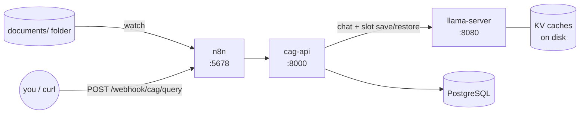

# llama-cag-n8n

**Ask questions about your documents with a fully local LLM — without the model
re-reading the document every time.**

This is a self-hosted implementation of **Cache-Augmented Generation (CAG)**: a
document is processed by the model **once**, the resulting KV cache (the model's
internal state after reading it) is **saved to disk**, and every later question
**restores** that state — so only your question and the answer are ever computed
again. On CPU hardware, that turns minutes of prompt processing into seconds.

Everything runs in Docker: [llama.cpp's `llama-server`](https://github.com/ggml-org/llama.cpp)
for inference and cache persistence, a small FastAPI orchestrator (`cag-api`),
[n8n](https://n8n.io/) for automation, and PostgreSQL for metadata. Works on
Windows, macOS, and Linux — no host compilation, no external APIs.



### CAG vs RAG, honestly

| | RAG | CAG (this project) |
|---|---|---|
| Document handling | chunk → embed → vector DB → retrieve per query | model reads the whole document once, state cached |
| Per-query cost | retrieval + re-processing of retrieved chunks | question + answer tokens only |
| Answer context | top-k chunks | the entire document, always |
| Corpus size | effectively unlimited | **must fit the context window** — that's the trade-off |

If your knowledge base is a handful of manuals, contracts, or specs (up to
~100k tokens each with the default model), CAG is simpler and often more
accurate. If it's ten thousand documents, you want RAG — and a different repo.

## Quick start

**Prerequisites:** [Docker Desktop](https://www.docker.com/products/docker-desktop/)
(or docker + compose v2) and Python 3.10+.

```bash
git clone https://github.com/VictorSteinbock/llama-cag-n8N.git
cd llama-cag-n8N

python llamacag.py setup     # writes .env with generated secrets
python llamacag.py start     # builds + starts the stack
```

First boot downloads the default model (Gemma 4 12B QAT, ~6.5 GB) from Hugging
Face into a Docker volume; after that everything runs offline. Watch progress
with `python llamacag.py logs llama-server`, and confirm readiness with
`python llamacag.py status`.

**Set up n8n (one-time, ~2 minutes):**

1. Open http://localhost:5678 and create the local owner account.
2. Import the three workflows from [`n8n/workflows/`](n8n/workflows/)
   (*Workflows → ⋯ → Import from file*).
3. Activate each one. **No credentials to configure** — the workflows only call
   `cag-api` over the internal Docker network.

**Use it:**

```bash
# 1. Make a document queryable (or just drop a file into ./documents/)
curl -X POST http://localhost:8000/documents -F "file=@manual.pdf"

# 2. Ask questions — via n8n's webhook…
curl -X POST http://localhost:5678/webhook/cag/query \
  -H "Content-Type: application/json" \
  -d '{"question": "What are the safety limits in section 4?"}'

# …or directly, or with the helper:
python llamacag.py query "What are the safety limits in section 4?"
```

The response includes `timings.cache_source` (`memory` / `disk` / `recomputed`)
and how many prompt tokens were actually evaluated — after the first query
that number should be tiny. That's the whole point.

## The API

Interactive docs at http://localhost:8000/docs.

| Endpoint | What it does |
|----------|--------------|
| `POST /documents` | Multipart file upload (`.txt` `.md` `.html` text-based `.pdf`) → extract, token-count, warm the KV cache, persist it |
| `POST /documents/text` | Same for raw text: `{"text": "...", "file_name": "notes.txt"}` |
| `GET /documents` | Registry with status, token counts, usage |
| `DELETE /documents/{id}` | Remove document + its cache file |
| `POST /query` | `{"question": "...", "document_id"?: n, "max_tokens"?: n, "temperature"?: x, "history"?: [{role, content}, …]}` — no `document_id` means the most recently cached document; `history` enables multi-turn chat (earlier turns stay KV-cached, so each round only evaluates the newest exchange) |
| `POST /maintenance` | Reconcile disk ↔ DB: delete orphaned caches, report missing ones, disk usage |
| `GET /health` | 200 healthy / 503 degraded, with per-dependency detail |

Duplicate content (same SHA-256) is detected and never re-warmed. A document
that doesn't fit the context window is rejected at ingest with a `413` telling
you the measured token count and which knob to raise.

## Choosing a model (state of play, mid-2026)

Set `LLAMA_MODEL` in `.env` to any GGUF on Hugging Face (`repo[:quant]`),
then `python llamacag.py stop && python llamacag.py start`:

| Model | Context | Download | Fits comfortably in | Notes |
|-------|---------|----------|---------------------|-------|
| `google/gemma-4-12B-it-qat-q4_0-gguf` *(default)* | 262k | 6.5 GB | 16 GB RAM | Google's official QAT build — Q4 with near-full quality, Apache 2.0 |
| `google/gemma-4-E4B-it-qat-q4_0-gguf` | 128k+ | ~3 GB | 8 GB RAM | Edge-class Gemma 4, lightest sensible option |
| `unsloth/Qwen3.5-9B-GGUF:Q4_K_M` | 256k+ | ~5.5 GB | 16 GB RAM | Strongest small dense alternative |
| `google/gemma-4-26B-A4B-it-qat-q4_0-gguf` | 256k | ~15 GB | 32 GB RAM | MoE: 26B-class answers at ~4B-active speed — best quality-per-second on big-RAM CPU boxes |
| `ggml-org/GLM-4.7-Flash-GGUF:Q4_K` | 202k | ~27 GB | 64 GB RAM | Workstation class |

Two knobs matter alongside the model:

- **`LLAMA_CTX_SIZE`** (default **65536**) — total context, split across slots;
  each document must fit `ctx ÷ slots − 1024`. KV memory scales with it, but
  **`LLAMA_CACHE_TYPE_KV=q8_0`** (the default) halves that at negligible
  quality cost — this is why 64k is now an affordable default.
- **`CAG_SLOTS`** (default **1**) — how many documents stay *hot in RAM* at
  once. With 2–4 slots, alternating between documents never touches disk;
  llama-server divides the context between them.

**Changing model or quant invalidates existing caches**; they self-heal
(recompute + re-save) on their next query.

### GPU acceleration

- **NVIDIA:** `python llamacag.py start --gpu` (CUDA image; NVIDIA Container
  Toolkit required — bundled with Docker Desktop on Windows).
- **Intel Arc / AMD:** `python llamacag.py start --vulkan` — passes `/dev/dri`
  through, so it works on **Linux hosts**. Docker Desktop's VM has no `/dev/dri`;
  on Windows laptops (including Intel Arc iGPUs) run the CPU stack — a modern
  multi-core CPU handles the 4–12B class fine, and CAG means the expensive
  prompt processing happens only once per document anyway.

## Configuration

Everything lives in `.env` (created by `setup`; see [.env.example](.env.example)
for all knobs and comments). The defaults are sensible; the ones you might touch:

| Variable | Default | |
|----------|---------|---|
| `LLAMA_MODEL` | `google/gemma-4-12B-it-qat-q4_0-gguf` | Model to download & serve |
| `LLAMA_CTX_SIZE` | `65536` | Total context (split across slots) |
| `CAG_SLOTS` | `1` | Documents kept hot in RAM simultaneously |
| `LLAMA_CACHE_TYPE_KV` | `q8_0` | KV cache precision (`f16` to disable quantization) |
| `LLAMA_EXTRA_ARGS` | — | Extra llama-server flags, e.g. `--cache-reuse 256` |
| `DOCUMENTS_FOLDER` | `./documents` | Folder watched by the ingestion workflow |
| `GENERIC_TIMEZONE` | `UTC` | Used by n8n schedules |
| `N8N_PORT` / `CAG_API_PORT` / `LLAMA_PORT` / `DB_PORT` | `5678/8000/8080/5432` | All bound to `127.0.0.1` |

## Troubleshooting

- **`status` shows llama-server unreachable right after start** — it's
  downloading the model. `python llamacag.py logs llama-server` shows progress.
- **Ingest returns 413 (document too large)** — the error includes the measured
  token count; raise `LLAMA_CTX_SIZE` in `.env` and restart, or split the file.
- **Everything is slow / OOM on Windows** — Docker Desktop's WSL2 VM defaults to
  half your RAM. The default model + 64k context wants ~10 GB in the VM; give it
  that (Settings → Resources, or `.wslconfig`), or lower `LLAMA_CTX_SIZE`, or
  switch to the E4B model.
- **Dropped a file but nothing happened** — is the *CAG Document Ingestion*
  workflow activated in n8n? Executions tab shows each attempt and any error.
  Warming a big document on CPU takes minutes: check `GET /documents` status.
- **First query after a restart is slower than the rest** — that's the one-time
  disk restore of the KV cache (still far cheaper than re-reading the document).
  If you see `cache_source: "recomputed"`, the cache file was lost/invalid and
  was rebuilt automatically.

## Project layout

```
├── api/                    # cag-api: FastAPI orchestrator (registry, slots, self-healing)
│   ├── app/                #   config / db / extract / llama client / cag engine / routes
│   └── tests/              #   unit + API tests (pytest, no services needed)
├── database/               # schema (documents, query_log) + n8n DB bootstrap
├── docs/                   # PRD.md and ARCHITECTURE.md — start there for design
├── n8n/workflows/          # 3 importable workflows: ingestion, query, maintenance
├── docker-compose.yml      # llama-server + cag-api + n8n + postgres
├── docker-compose.gpu.yml  # NVIDIA (CUDA) override
├── docker-compose.vulkan.yml # Intel/AMD GPU override (Linux hosts)
└── llamacag.py             # setup / start / stop / status / logs / query
```

## Upgrading from v1

v2 is a rebuild, not an upgrade — v1's KV caches never worked (its scripts
called llama.cpp flags that don't exist) so there is nothing to migrate. If you
ran v1: `docker compose down -v` on the old checkout, pull, then follow the
quick start. The full reasoning is in [docs/PRD.md](docs/PRD.md) and
[docs/ARCHITECTURE.md](docs/ARCHITECTURE.md).

## Development

```bash
pip install -e "./api[dev]"
pytest api            # 32 tests, no Docker needed
ruff check api
```

CI runs lint, tests, workflow JSON validation, and a compose config check on
every push.

## Acknowledgements

- [llama.cpp](https://github.com/ggml-org/llama.cpp) — inference, and the slot
  save/restore API that makes honest CAG a config option instead of a science project
- [n8n](https://n8n.io/) — the automation layer

## License

[MIT](LICENSE)
