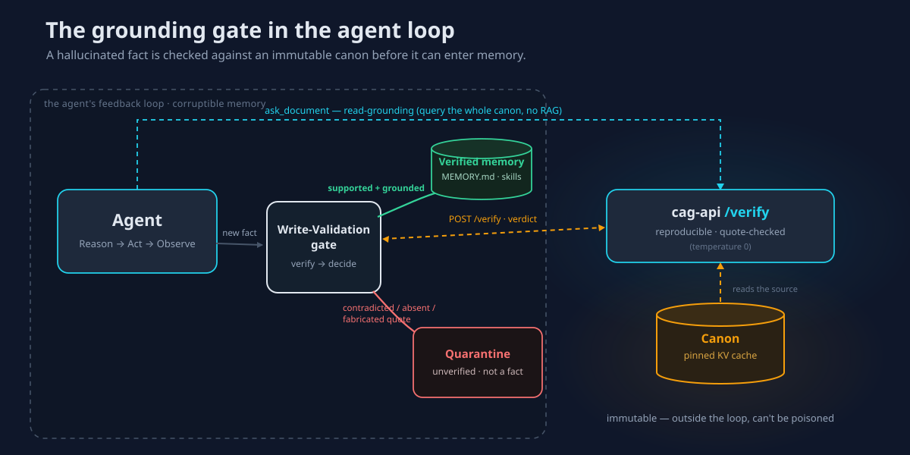

# Grounding agents against drift

*How to use this stack as a **grounding gate** inside an agent's feedback loop —
so a hallucinated fact can't be written to memory and then retrieved-and-reinforced
into persistent drift. Concrete recipes for [OpenClaw](https://docs.openclaw.ai)
and [Hermes Agent](https://hermes-agent.nousresearch.com), with working code in
[`../integrations/`](../integrations).*

  

## The problem: self-improving memory drifts

Modern agent runtimes get better by **remembering**. OpenClaw keeps a persistent
`MEMORY.md` across sessions and runs on a schedule; Hermes Agent keeps **episodic
memory** and even writes its own **skills** after tasks. That is also the failure
mode. Recent work describes a **compounding loop across three interfaces**:
*ingestion* (a bad fact enters), *consolidation* (it's written to memory — drift),
and *retrieval* (it's pulled back and reinforced — hallucination). Unlike static
RAG, where an error is isolated to one retrieval, **errors in evolving memory are
cumulative and persistent** — "self-improvement" quietly becomes **self-poisoning**,
and behavioural drift shows up *long before* any single memory entry would trip a
safety classifier. The literature's prescribed defence is a **Write-Validation**
pathway (govern what gets consolidated) plus **Read-Filtering** (govern what gets
retrieved). See the [sources](#sources).

OpenClaw ships approval gates for high-*impact* actions but **no fact-checking at
all**; Hermes exposes plugin hooks but its memory writes are ungoverned. Neither
has an anchor to ground against.

## The idea: an immutable canon *outside* the loop

Everything the agent believes lives in *its* memory, which is inside the feedback
loop and therefore corruptible. This stack gives you a **canon that lives in the
cag-api KV cache — outside the agent's memory** — so it can't be poisoned by the
agent's own drift. It is:

- **reproducible** — `temperature 0`, same claim → same verdict;
- **mechanically checkable** — [`POST /verify`](../README.md#the-api) confirms the
  cited quote actually occurs in the source bytes (`quote_grounded`), so a
  fabricated citation is caught with **zero** extra model calls;
- **calibratable** — measure the canon's miss rate with
  [`/documents/{id}/calibrate`](../README.md#know-your-canons-reliability) before you
  trust it;
- **local** — the whole thing runs on your hardware, like the agents themselves.

Deploy it two ways, both implemented in [`../integrations/`](../integrations):

1. **Write-Validation gate** — verify a fact *before* it enters agent memory.
   Contradicted / absent / fabricated-quote facts are quarantined, never stored as
   verified. **This breaks the compounding loop at the consolidation interface.**
2. **Read-grounding tool** — let the agent ask the whole canon a question
   (`ask_document` / `/query`) instead of a vector DB whose retrieval is itself a
   drift-and-poisoning surface.

## The fail-safe policy

The gate ([`cag_gate.GroundingGate`](../integrations/cag_gate)) maps a verdict to
an action, and it **fails closed**:

| `/verify` result | Memory write | Action gate |
|---|---|---|
| `supported`, quote is in the source | **allow** | **allow** |
| `supported` but quote **not** in source (fabricated) | quarantine | block |
| `supported` but quote too short/generic to be evidence | quarantine | escalate |
| `contradicted` | quarantine | block |
| `absent` (canon doesn't mention it) | quarantine, tag `unverified` | escalate to human |
| oracle unreachable / unknown verdict | quarantine | escalate |

Only `supported` **with a grounded, non-trivial quote** is ever trusted. The
byte-check proves *existence*, not sufficiency — a generic fragment ("is the")
grounds in any document, and an empty quote isn't even checkable — so the gate's
**evidence floor** (`Policy.min_grounded_quote_chars`, default 12 collapsed
chars, zero-width padding stripped) refuses those as evidence. `absent` is the
honest weak spot — there is no passage to ground — so it is never auto-trusted
as a fact.

## Where it factors in — the plumbing

### Hermes Agent

Hermes plugins register tools and hooks in a `register(ctx)` entry point. The
[bundled plugin](../integrations/hermes) wires in:

| Surface (Hermes API) | What we add | Interface it protects |
|---|---|---|
| `register_tool` | `cag_verify(claim)`, `cag_ask(question)` | Read-grounding |
| `register_tool` | `cag_remember(fact)` — verify-then-store; quarantine the rest | **Consolidation (Write-Validation)** |
| `register_tool(..., override=True)` | `CAG_OVERRIDE_MEMORY=1` replaces the built-in `memory` tool for *hard* enforcement | Consolidation |
| `register_hook("post_tool_call", …)` | reactive net: flag a direct memory write the canon contradicts | Consolidation |
| `register_hook("pre_llm_call", …)` | inject a one-line grounding reminder each turn | Steering |

An honest caveat baked into the design: Hermes `pre_tool_call`/`post_tool_call`
hooks are **observers** (their return value is ignored), so a hook cannot *veto* a
write. Real gating therefore goes through the `cag_remember` tool (or `override=True`
on `memory`), with the hook as a reactive safety net. Install steps:
[`../integrations/hermes/README.md`](../integrations/hermes/README.md).

### OpenClaw

OpenClaw skills are `SKILL.md` files that can call CLIs. The
[`cag-verify` skill](../integrations/openclaw) ships a self-contained checker the
agent runs before it stores a fact or sends a factual message; `exit 0` = trusted,
`exit 1` = do not. Two higher-order recipes:

- **Compliance anchor** — pin your SOP/policy doc; make `cag-verify` a required
  pre-send step, fail-closed to the human approval OpenClaw already supports.
- **Memory-hygiene cron** — a scheduled job re-verifies stored `MEMORY.md` facts and
  quarantines contradicted ones, countering uncontrolled memory growth.

### Anything else

Every runtime can `POST /verify` (or use the MCP `verify` / `ask_document` tools, or
the n8n `answer-gate` / `claim-verification` webhooks). The
[`cag_gate`](../integrations/cag_gate) package is a 3-file, stdlib-only reference you
can vendor anywhere.

## How it alters the outcome

Canon = your pinned vendor API spec. A Hermes agent, mid-task, reads a forum post
claiming *"rate limit is 1000 req/s"* (the spec says 100).

- **Without the gate:** it writes `rate_limit = 1000` to `MEMORY.md` → a later task
  **retrieves that memory**, builds a client at 1000 req/s, ships it → prod breakage.
  The poisoned memory keeps surfacing for every future rate-limit decision.
  Cumulative, persistent.
- **With the Write-Validation gate:** the write is checked → `contradicted`, quote
  *"requests are capped at 100/s (§4.2)"*, `quote_grounded: true` → the fact is
  quarantined, not stored. **The hallucination never enters long-term memory, so it
  can never be retrieved and reinforced.** The canon that made the ruling lives
  outside the agent's memory, so it can't be drifted either. (This exact trace is a
  test: [`test_memory_write_gate_quarantines_the_poison`](../integrations/tests/test_gate.py).)

## Honest limits

- **Asymmetric.** Grounding hardens `supported`/`contradicted` (there's a passage to
  check) but **cannot** harden `absent`. Fail-safe: auto-pass only `supported` +
  grounded; route the rest to a human or to quarantined memory.
- **Conformance, not omniscience.** It enforces agreement with *the canon you
  pinned*, not universal truth. A wrong — or hostile — canon → confident wrong
  grounding (the model is *instructed to obey* the document, so a malicious
  document can steer answers about itself). Ingest sources you trust,
  `calibrate` them, and `prepare` visual PDFs into clean text first.
- **Existence vs entailment.** The quote check is mechanical; whether the quote
  actually *entails* the claim is still the model's judgement at `temperature 0` —
  reproducible, not infallible. And existence alone is weak evidence for short
  strings — hence the evidence floor above; it is a heuristic, not a proof.
- **Cost.** Each gate is one local `temperature 0` call. Gate the *consequential*
  writes and actions, not every token.

## High-demand use cases

1. **Compliance anchor for a 24/7 OpenClaw agent** — pin the SOP/policy/regulatory
   doc; gate every outbound action against it.
2. **Memory hygiene for self-improving Hermes agents** — stop self-improvement from
   becoming self-poisoning (the top durable-compromise vector in the literature).
3. **RAG-free grounded knowledge tool** — `ask_document` over the *whole* canon
   instead of a poisonable retrieval index.
4. **Spec-conformance gate in autonomous coding loops** — pre-write gate: "does this
   change conform to the pinned spec?"
5. **Fact-checked outbound comms** — gate factual claims in customer/user messages
   before they're sent.

## Sources

- OpenClaw: [overview](https://dextralabs.com/blog/openclaw-ai-agent-frameworks/) ·
  [skill format](https://docs.openclaw.ai/clawhub/skill-format)
- Hermes Agent: [agent loop](https://hermes-agent.nousresearch.com/docs/developer-guide/agent-loop)
  · [build a plugin](https://hermes-agent.nousresearch.com/docs/guides/build-a-hermes-plugin)
  · [Hermes-Function-Calling](https://github.com/NousResearch/Hermes-Function-Calling)
- Drift & memory poisoning: [Governing Evolving Memory / SSGM (arXiv 2603.11768)](https://arxiv.org/html/2603.11768)
  · [MemoryGraft (arXiv 2512.16962)](https://arxiv.org/html/2512.16962v1)
  · [Agent Drift (arXiv 2601.04170)](https://arxiv.org/pdf/2601.04170)
