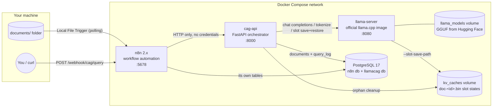
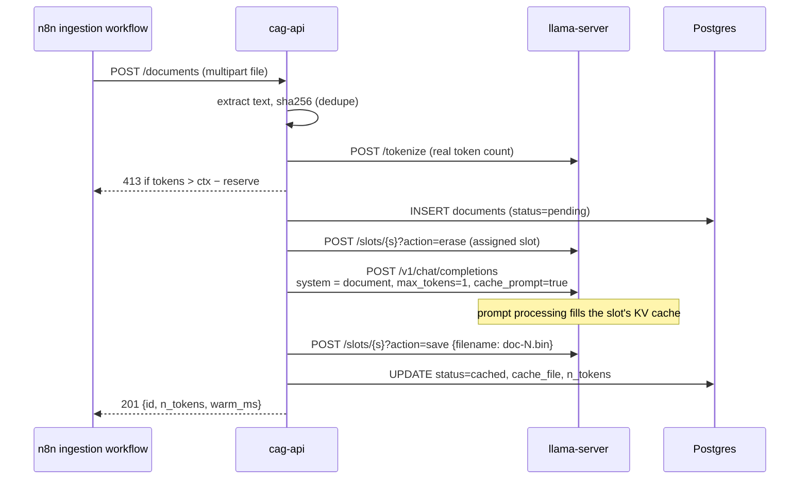
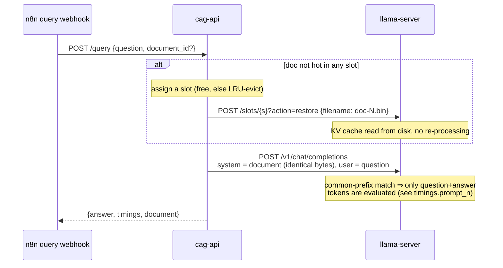

# Architecture — llama-cag-n8n v2

Four containers, one compose file. Everything runs locally; ports bind to `127.0.0.1`.



## Components and responsibilities

| Component | Image | Owns |
|-----------|-------|------|
| **llama-server** | `ghcr.io/ggml-org/llama.cpp:server` (`:server-cuda` with `--gpu`, `:server-vulkan` with `--vulkan`) | Model download (`-hf`), tokenization, inference, prompt templating, per-slot KV cache in RAM (quantized `q8_0`), KV persistence to disk (`--slot-save-path`) |
| **cag-api** | built from [`api/`](../api) | Document registry, text extraction (txt/md/html/pdf), context-fit validation, slot orchestration (which doc is "hot"), self-healing, query log, maintenance |
| **n8n** | `docker.n8n.io/n8nio/n8n` | Automation only: folder watch → ingest, webhook → query, schedule → maintenance. Zero business logic, zero credentials |
| **postgres** | `postgres:17-alpine` | `n8n` database (n8n internal) + `llamacag` database (`documents`, `query_log`) |

The v1 components this replaces: `bridge/cag_bridge.py` (raw HTTP server shelling out
with string-interpolated commands), `scripts/bash/*.sh` (called llama.cpp flags that
don't exist), `setup.py` (built llama.cpp from source on the host), host-mounted
binaries in containers.

## How the CAG mechanism actually works

llama-server keeps per-slot KV caches and can persist them. We run `CAG_SLOTS`
slots (`--parallel N`, default 1) and treat each as a hot-document seat: the
engine assigns documents to slots with LRU eviction, so up to N documents keep
their KV state resident in RAM and switching between them costs nothing. The
total context is divided evenly, so each slot (and therefore each document)
gets `LLAMA_CTX_SIZE / CAG_SLOTS` tokens. KV memory is halved by `q8_0`
key/value quantization (default; flash attention is auto-enabled), which is
what makes a 64k default context affordable on consumer RAM.

**Ingest (warm once):**



**Query (cheap forever after):**



Two invariants make the prefix reuse work:

1. **The system message for a document is byte-identical** across warm and every query.
   The server templates it identically, so the templated token prefix matches what is in
   the slot, and `cache_prompt: true` skips it.
2. **Warm and query share the same message shape** (system + user). Some chat templates
   (e.g. Gemma's) merge the system message into the first user turn; because the merged
   document part is still an identical prefix, reuse still covers ~all document tokens —
   only the few tokens after the document diverge.

**Self-healing:** if `action=restore` fails (file deleted, corrupt, structurally
incompatible after a model change), the API logs it and proceeds anyway —
`cache_prompt` recomputes the full prefix (slow, correct) and the API re-saves the
slot so the next query is fast again (deferred, off the request path).

**Model fingerprint:** llama.cpp validates a restored state file *structurally*
(layer count, KV types, geometry) but stores no identity of the weights that
produced it — a same-geometry switch (different weight quant, a fine-tune of the
same base) would restore stale KV state **silently**. cag-api closes that hole:
on its first llama interaction per process it compares `/props` `model_path`
against a `model.marker` file beside the caches, and on mismatch wipes all
`*.bin` once (they re-warm on next use) and rewrites the marker.

## Data model (`llamacag` database)

```sql
documents(id, slug, file_name, content, content_sha256 UNIQUE, n_tokens,
          cache_file, status pending|cached|failed, error,
          created_at, cached_at, last_used_at, use_count)

query_log(id, document_id → documents ON DELETE SET NULL, question, answer,
          success, error, n_prompt_tokens, n_cached_tokens, n_eval_tokens,
          duration_ms, created_at)
```

v1's five tables, three trigger functions, and chunk registry are gone — chunking was
removed with the RAG-ish "query multiple caches" path (see PRD non-goals).

## Request-path rules

- **No shell.** The API never spawns processes. v1's command-injection vector
  (question string → `subprocess` with `shell=True`) is structurally impossible now.
- **Parameterized SQL only** (psycopg 3).
- **One lock around slot use.** Slot assignment + restore + completion is atomic per
  query; concurrent webhook calls queue. CPU inference is serial anyway. There is
  deliberately no request semaphore or queue limit: inference is serialized by the
  engine lock and concurrent consumers simply queue on it (bounded by FastAPI's
  threadpool), which is correct for a single-user loopback stack. A second,
  momentary micro-lock (`_slots_guard`) covers only the slot-map dicts so
  `/health` can snapshot them without queueing behind a long generation — writers
  take it nested inside the big lock, and it is never held across I/O.
- **Timeouts everywhere:** warm 60 min, query 10 min (CPU worst cases), health 5 s.

**Deferred design: per-slot concurrency.** Per-slot inference locking (letting two
slots generate at once) was considered and deferred: LRU slot eviction under
concurrent slot use would break the restore + completion atomicity invariant, CPU
inference gains nothing from it (the same cores serve both generations), and the
single-user PRD target doesn't need it. Revisit as a designed milestone if a
multi-user GPU deployment ever becomes a goal — not as a patch.

## Configuration

Single `.env` (generated by `python llamacag.py setup`). The important knobs:

| Variable | Default | Meaning |
|----------|---------|---------|
| `LLAMA_MODEL` | `google/gemma-4-12B-it-qat-q4_0-gguf` | Any GGUF on Hugging Face, `repo[:quant]` |
| `LLAMA_CTX_SIZE` | `65536` | Total context in tokens, divided across slots |
| `CAG_SLOTS` | `1` | Hot documents held in RAM simultaneously (llama-server `--parallel`) |
| `LLAMA_CACHE_TYPE_KV` | `q8_0` | KV cache precision; halves KV memory vs `f16` |
| `LLAMA_EXTRA_ARGS` | empty | Appended verbatim to llama-server (e.g. `--cache-reuse 256`) |
| `LLAMA_THREADS` | `-1` (auto) | CPU threads for inference |
| `DOCUMENTS_FOLDER` | `./documents` | Host folder watched by n8n |
| `DB_PASSWORD`, `N8N_ENCRYPTION_KEY`, `N8N_USER_MANAGEMENT_JWT_SECRET` | generated | Never committed, never defaulted |

GPU: `python llamacag.py start --gpu` layers `docker-compose.gpu.yml` on top (CUDA image
+ `--gpu-layers 999` + device reservation); `--vulkan` layers `docker-compose.vulkan.yml`
(Intel Arc / AMD via `/dev/dri` — Linux hosts only, Docker Desktop's VM has no `/dev/dri`).

## Failure modes

| Failure | Behaviour |
|---------|-----------|
| llama-server down | `cag-api /health` → `degraded`, queries → 502 with reason; n8n error branch returns it to the caller |
| Postgres down | API startup retries; requests → 503 |
| Cache file missing | Query self-heals (recompute + re-save); maintenance flags it |
| Document too large | 413 at ingest with the measured token count and the knob to change |
| Same file dropped twice | 200, `deduplicated: true`, no re-warm |
| Client disconnects mid-query | The worker thread completes normally (generation is bounded by `max_tokens`, locks are released by context managers, httpx timeouts are the hard ceiling), the response is discarded, and the answer still lands in `query_log` — a "zombie lock" is structurally impossible |
