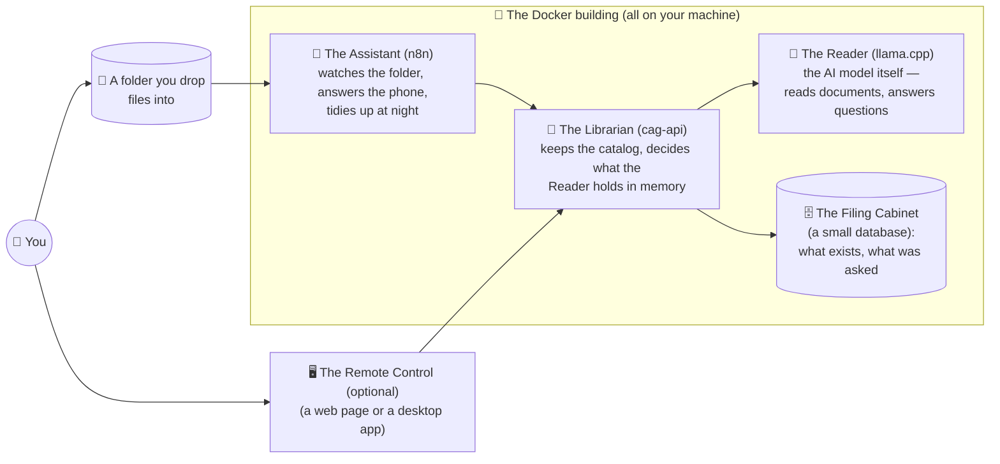

# What is this, in plain words

*The two-minute version, no jargon. For the technical version, see the
[README](../README.md).*

  

## The idea, as a story

Imagine hiring a brilliant, very fast reader. You hand them your 200-page
manual. They read the **whole thing, once**, carefully — and then they never
forget it. From that moment on, you can walk up any time — today, next week,
after the power went out — and just ask: *"What's the maximum load in
section 4?"* They answer instantly, from memory of the entire book.

That's this project. The "reader" is an AI model running **on your own
computer**. Reading the document once is the only expensive step; the reader's
memory of it is saved to your disk so it survives shutdowns. Every question
after that is fast and cheap, because nothing gets re-read.

  

Most other tools work like a **filing clerk** instead: every time you ask
something, they run to the cabinet, grab a few pages that *look* relevant, skim
them again, and answer from those pages only. That's faster to set up and fine
for huge archives — but the clerk never sees the whole book at once, and does
the skimming again on every single question. Our reader saw everything, and
only ever does the reading once.

## It doesn't just answer — it checks

There's a second thing the reader does, and it has become the heart of this
project: **checking claims, with receipts.**

Hand the system a sentence — from a colleague's draft, from another AI, from
your own notes — and ask: *is this actually what the document says?* The
reader gives one of three verdicts: **supported** (here's the exact passage),
**contradicted** (here's the passage that says otherwise), or **absent** (the
document doesn't say). Then comes the part no AI opinion can fake: the system
takes the quoted passage and **mechanically checks that those words really are
in the book** — a plain text search, like Ctrl+F. An AI that invents a
convincing-sounding quote is caught by string matching, not by another AI's
say-so.

Why does that matter? Because the ones asking are increasingly not people.
Chatbots and autonomous agents are eager to please and occasionally state
things that aren't so — and worse, they *remember* their own mistakes and
build on them. Put this system between an agent and anything that matters —
as a **gate** — and its claims get checked against your one trusted document
before anyone, or anything, acts on them. The eager intern's work gets
reviewed against the binder by a colleague who actually read the whole thing.

## Who lives on your computer

When you start the system, five characters wake up. Four live inside Docker
(think: a tidy apartment building for programs); the fifth is an optional screen
you can open if you feel like it — a built-in web page, or a desktop app:

- **The Reader** does the actual thinking. It downloads its "brain" (the AI
  model, one ~6.5 GB file) from the internet **once**, then works fully offline.
- **The Librarian** is the boss of the operation: it receives your documents,
  has the Reader study them, saves the Reader's memory to disk, and brings the
  right memory back when you ask about a particular document.
- **The Assistant** handles automation: drop a file in the folder → it gets
  studied automatically; it also exposes the "phone line" other programs can
  call, and runs a nightly cleanup.
- **The Filing Cabinet** just keeps records — which documents exist, every
  question and answer.
- **The Remote Control** is optional — a friendly screen for when you'd rather
  click than type: chat with a document, see what's stored, check everything is
  healthy, switch the AI model. It comes in two overlapping forms: a **built-in
  web page** (open `localhost:8000/ui` in a browser — nothing to install) and a
  separate **desktop app** (LlamaCag UI). You don't need either — you can just
  drop files in the folder and ask through the Assistant — they're only windows
  onto what's already happening.

None of them ever talk to the internet while working. Your documents,
questions, and answers never leave your machine.

## What actually happens

**When you add a document** (drop a file in the folder, or upload in the app):
the Assistant notices it → the Librarian extracts the text and checks it fits →
the Reader studies the whole thing (this is the slow part — minutes for a big
document) → the Reader's memory of it is saved to disk. Done forever, unless
the document changes.

**When you ask a question:** the Librarian makes sure the right document's
memory is loaded (from disk if needed — a second or two, no re-reading) → the
Reader answers using the *entire* document → you get the answer plus a little
receipt showing it only had to process your question, not the book.

**When you ask it to check a claim:** same path as a question, but the answer
comes back as a verdict — supported, contradicted, or absent — plus the exact
passage it rests on, and the system double-checks with a plain text search (no
AI involved) that the passage really exists in the document.

## Is this for me?

  

**Yes, if:** you have a handful of dense documents — a product manual, a
contract, a rulebook, a thesis — and you (or a chatbot, or an automation, or a
coding assistant) will ask them many questions over time, and you'd like that
to be private, free per-question, and running on hardware you own. Also yes if
you use *other* AI tools and want their claims checked against a document you
trust before you act on them — that's the gate, and it's the job this system
has turned out to be best at.

**No, if:** you have thousands of documents (get a "filing clerk" tool — that's
what they're great at), or documents too big to fit the Reader's attention span
(the system will tell you, politely, with the exact numbers).

## What you need

A computer with Docker installed and ~10 GB of memory to spare, one `python
llamacag.py setup`, one `python llamacag.py start`, and patience for a one-time
model download. For a calm, click-by-click walkthrough — including a
*"let Claude Code do it"* option — see the **[setup guide](SETUP.md)**. Curious
what people actually run on this? The **[use-case tour](USE-CASES.md)** shows
five real setups, one picture each; everything else is in the
[README](../README.md).
