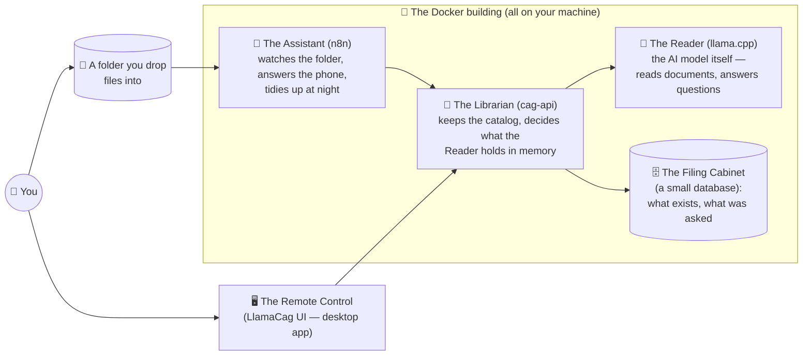

# What is this, in plain words

*The two-minute version, no jargon. For the technical version, see the
[README](../README.md).*

  

## The idea, as a story

Imagine hiring a brilliant, very fast reader. You hand them your 200-page
manual. They read the **whole thing, once**, carefully — and then they never
forget it. From that moment on, you can walk up any time — today, next week,
after the power went out — and just ask: *"What's the maximum load in
section 4?"* They answer instantly, from memory of the entire book.

That's this project. The "reader" is an AI model running **on your own
computer**. Reading the document once is the only expensive step; the reader's
memory of it is saved to your disk so it survives shutdowns. Every question
after that is fast and cheap, because nothing gets re-read.

  

Most other tools work like a **filing clerk** instead: every time you ask
something, they run to the cabinet, grab a few pages that *look* relevant, skim
them again, and answer from those pages only. That's faster to set up and fine
for huge archives — but the clerk never sees the whole book at once, and does
the skimming again on every single question. Our reader saw everything, and
only ever does the reading once.

## Who lives on your computer

When you start the system, five characters wake up. Four live inside Docker
(think: a tidy apartment building for programs), one is a normal desktop app:

- **The Reader** does the actual thinking. It downloads its "brain" (the AI
  model, one ~6.5 GB file) from the internet **once**, then works fully offline.
- **The Librarian** is the boss of the operation: it receives your documents,
  has the Reader study them, saves the Reader's memory to disk, and brings the
  right memory back when you ask about a particular document.
- **The Assistant** handles automation: drop a file in the folder → it gets
  studied automatically; it also exposes the "phone line" other programs can
  call, and runs a nightly cleanup.
- **The Filing Cabinet** just keeps records — which documents exist, every
  question and answer.
- **The Remote Control** is the friendly desktop app: chat with a document, see
  what's stored, check that everything is healthy, switch the AI model.

None of them ever talk to the internet while working. Your documents,
questions, and answers never leave your machine.

## What actually happens

**When you add a document** (drop a file in the folder, or upload in the app):
the Assistant notices it → the Librarian extracts the text and checks it fits →
the Reader studies the whole thing (this is the slow part — minutes for a big
document) → the Reader's memory of it is saved to disk. Done forever, unless
the document changes.

**When you ask a question:** the Librarian makes sure the right document's
memory is loaded (from disk if needed — a second or two, no re-reading) → the
Reader answers using the *entire* document → you get the answer plus a little
receipt showing it only had to process your question, not the book.

## Is this for me?

**Yes, if:** you have a handful of dense documents — a product manual, a
contract, a rulebook, a thesis — and you (or a chatbot, or an automation, or a
coding assistant) will ask them many questions over time, and you'd like that
to be private, free per-question, and running on hardware you own.

**No, if:** you have thousands of documents (get a "filing clerk" tool — that's
what they're great at), or documents too big to fit the Reader's attention span
(the system will tell you, politely, with the exact numbers).

## What you need

A computer with Docker installed and ~10 GB of memory to spare, one `python
llamacag.py setup`, one `python llamacag.py start`, and patience for a one-time
model download. Everything else is in the [README](../README.md).
