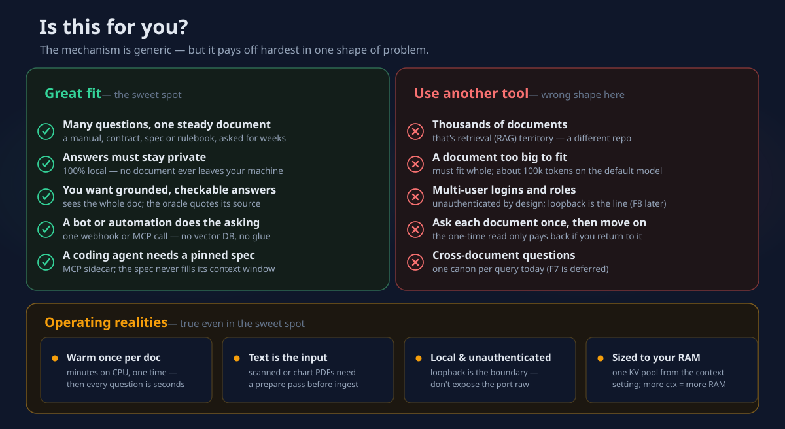

# Setup, in plain words

*A calm, step-by-step guide to getting this running — written for someone who is
**not** comfortable with terminals and Docker. If you already are, the
[README Quick start](../README.md#quick-start) is the two-command version.*

There are two honest paths below. Pick one:

- **[Let Claude Code do it](#let-claude-code-do-it)** — if you have the Claude
  Code app, you can paste one message and let it drive. Easiest by far.
- **[Do it yourself, step by step](#do-it-yourself-step-by-step)** — about
  15 minutes of your attention plus a one-time download that runs on its own.

First, a 30-second gut check that this is even the right tool for you:

<p align="center">
  
</p>

If the left column sounds like you, read on. If the right column does, the
[README](../README.md#cag-vs-rag-honestly) points you at the better tool
honestly — no hard feelings.

---

## Let Claude Code do it

If you have [Claude Code](https://claude.com/claude-code) installed, you barely
need the rest of this guide. Open a terminal in an **empty folder** where you'd
like the project to live, start Claude Code, and paste this:

```text
Set up the llama-cag-n8n stack on this machine for me.

1. Check whether Docker Desktop and Python 3.10+ are installed, and if either is
   missing, tell me exactly how to install it and wait for me.
2. Clone https://github.com/VictorSteinbock/llama-cag-n8n-reworked and read its
   README.md and CLAUDE.md so you understand the stack.
3. Run `python llamacag.py setup`, then `python llamacag.py start`.
4. The first start downloads a ~6.5 GB model — watch the llama-server logs and
   keep me posted on progress; don't declare it done until the download finishes.
5. Confirm `python llamacag.py status` reports healthy.
6. Ingest the bundled sample `samples/refund-policy.md`, then run one test query
   so I can see a real answer with its token receipt.

Explain what each step does as you go, in plain language.
```

Claude Code will handle the terminal parts end-to-end and narrate what it's
doing. **The one thing it can't click for you** is n8n's first-run browser
screen — creating the local account and importing the automation workflows. It
will point you there when the time comes; that's a 2-minute, one-time step
described in [Turn on the automation](#optional-turn-on-the-automation-n8n)
below. Prefer to skip n8n entirely? You can — the web UI and the API work
without it.

> **Why this is safe to hand off.** Everything Claude Code runs here is local:
> cloning a public repo, writing a settings file, and starting Docker
> containers on your own machine. Nothing about your documents or questions
> leaves the computer. You can read every command before you approve it.

---

## Do it yourself, step by step

You will type a few commands. That's normal and you can't easily break anything —
if a step misbehaves, the [troubleshooting](#if-something-looks-wrong) section at
the bottom covers the common cases.

### Step 1 — Install Docker Desktop

Docker is a free app that runs this project's four background programs in tidy,
isolated boxes, so they never touch the rest of your system. Install it from
**[docker.com/products/docker-desktop](https://www.docker.com/products/docker-desktop/)**,
then **launch it and leave it running**.

You'll know it's ready when the little whale icon (menu bar on Mac, system tray
on Windows) stops animating and its menu says *"Docker Desktop is running."*

- **Windows:** if it offers to enable WSL2 during install, say yes — that's the
  engine it needs.
- **Mac / Windows laptops:** give it a little room. In *Docker Desktop →
  Settings → Resources*, make sure it can use **at least ~10 GB of memory**
  (that's what the default model plus its context wants).

### Step 2 — Install Python

Many computers already have it. Check by opening a terminal (Terminal on Mac,
**PowerShell** on Windows) and typing:

```bash
python --version
```

If it prints `Python 3.10` or higher, you're set. If not, install it from
**[python.org/downloads](https://www.python.org/downloads/)**. On Windows, tick
**"Add Python to PATH"** in the installer — it's an easy box to miss.

### Step 3 — Get the project onto your computer

Either way lands you in the same place; pick whichever feels comfortable:

- **The simple way (no git):** go to the
  [project page](https://github.com/VictorSteinbock/llama-cag-n8n-reworked),
  click the green **Code** button → **Download ZIP**, then unzip it somewhere
  you'll remember.
- **The git way:** `git clone https://github.com/VictorSteinbock/llama-cag-n8n-reworked.git`

Now open a terminal **inside that folder** (the one containing `llamacag.py`).
On Windows you can shift-right-click the folder → *"Open PowerShell window
here."*

### Step 4 — One-time setup

```bash
python llamacag.py setup
```

This writes a settings file (`.env`) and **invents strong passwords for you** so
the internal database is secure without you having to think about it. It finishes
in a second or two.

### Step 5 — Start everything (the patience step)

```bash
python llamacag.py start
```

This builds the boxes and turns them on. **The very first start downloads the AI
model — one file, about 6.5 GB — from the internet.** On a slow connection this
can take a long while, and the terminal may look like nothing is happening.

**It is not stuck. It is downloading, once, forever.** Watch the progress with:

```bash
python llamacag.py logs llama-server
```

After this first time, the model lives in a local Docker volume: the stack
starts in seconds and never needs the internet again.

### Step 6 — Check it's healthy

```bash
python llamacag.py status
```

When it reports everything healthy, you're done. (Right after a start it may
briefly say llama-server is unreachable — that's still the model download
finishing. Give it a few minutes.)

### Step 7 — Try it (the fun part)

Open **http://localhost:8000/ui** in any browser. No documents yet? The empty
screen offers **Try a sample** — one click loads a bundled example and drops you
into chat. Ask it a question and watch the little **receipt** under the answer:
it shows the model only had to process *your question*, not the whole document.
That receipt is the entire point of the project, made visible.

### Optional: turn on the automation (n8n)

You only need this if you want the **folder-drop** convenience (drop a file into
`./documents` and it gets studied automatically) or the **webhooks** that let
other tools ask questions. The web UI and API above already work without it.

1. Open **http://localhost:5678** and create the local owner account. This
   account lives only on your machine.
2. Import the workflows from the [`n8n/workflows/`](../n8n/workflows/) folder
   (*Workflows → ⋯ → Import from file*), then **activate** each one.
3. There are **no passwords to configure** — the workflows only talk to the
   project's own API over Docker's internal network.

---

## If something looks wrong

- **`status` says llama-server is unreachable right after starting** — it's still
  downloading or loading the model. Watch `python llamacag.py logs llama-server`;
  give it a few minutes on the first run.
- **Everything feels slow, or it runs out of memory (Windows)** — Docker's built-in
  Linux VM often defaults to half your RAM. The default model wants ~10 GB; raise
  it in *Docker Desktop → Settings → Resources*, or switch to a smaller model
  (see [Choosing a model](../README.md#choosing-a-model-state-of-play-mid-2026)).
- **"document too large" when you add a file** — the document doesn't fit the
  model's attention span. The error tells you the exact size; split the file, or
  raise `LLAMA_CTX_SIZE` in `.env` and restart.
- **You dropped a file in the folder but nothing happened** — that's the n8n
  automation; make sure you did the [optional n8n step](#optional-turn-on-the-automation-n8n)
  and **activated** the ingestion workflow.

The [README's Troubleshooting section](../README.md#troubleshooting) has the
fuller list.

---

## What's private, and what leaves your machine

Almost nothing leaves. **Two moments** touch the internet, both optional and
one-time:

1. **The model download** on first start (Step 5) — the AI's "brain," fetched
   once from Hugging Face, then cached locally forever.
2. **Preparing a visual PDF** *only if* you deliberately configure a cloud
   converter for scanned documents (see
   [Preparing documents](../README.md#preparing-documents-pdfs-scans-tables)) —
   the local converters keep even that on your machine.

Your **documents, your questions, and the answers never leave the computer.**
The whole stack is bound to `localhost` — it isn't reachable from other machines
unless you go out of your way to expose it (and the README's
[Quick start](../README.md#quick-start) has a security note explaining why you
should only do that behind a login).

---

*Want the two-minute story of how this works, with no setup at all? Read
**[the plain-words explainer](EXPLAINER.md)**. Ready for the full technical
picture? That's the **[README](../README.md)**.*
