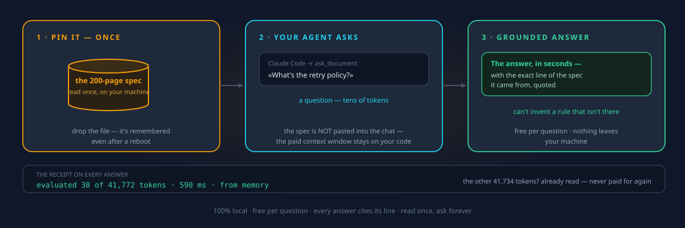

# Why I'm building this, honestly

I'm not a professional in this field. I work remotely, the laptop is dated, and
this is what I do in my spare time. About a year ago I tried to build this exact
idea and gave up halfway: the scripts called llama.cpp flags that didn't exist,
the caching was tied to one model in a way that silently corrupted answers, and
I didn't understand enough of what I was doing. This is the second attempt,
rebuilt from zero, and this time I want other eyes on it before I sink deeper.

## The itch I'm scratching

Three things kept bothering me:

1. **Models re-read the same document over and over.** If I have one dense
   manual and a hundred questions, why am I paying (in time or tokens) for a
   hundred full reads? The document didn't change.
2. **Models invent policy.** Ask a support bot something slightly off the beaten
   path and it will confidently make up a refund rule. I wanted answers that
   carry the exact line they came from, checked mechanically, not by vibes.
3. **Agents drift.** The new crop of self-improving agents (OpenClaw, Hermes)
   write their own memory. One hallucinated fact gets stored, then retrieved,
   then reinforced. Nobody ships a ground-truth check for that loop.

## What it does today

The model reads your document once. Its internal state (the KV cache) is saved
to disk. Every question after that restores the state instead of re-reading, so
only your question and the answer are ever computed. That's the whole trick.

  

On top of that sits the part I care most about, a verification endpoint: give it
a claim, it answers at temperature 0 with a verdict plus the supporting quote,
and then the code checks byte-by-byte that the quote actually exists in the
source. A made-up citation gets caught without any extra model call. That
endpoint is what the agent gate is built on:

  

The five setups I think this is actually for are one page each in the
[use-case deck](USE-CASES.md), each with its honest limits printed on the slide.

## What I have actually tested, and what I haven't

I want to be straight about this, because it's the part that would annoy me if
someone else hid it.

**Tested by me:** the core loop (ingest, query, restore after restart, the
self-heal path when cache files go missing), the verify endpoint's mechanics,
the model-switch guard, the web UI (offline browser walkthrough), and the whole
test suite (126 api + 27 mcp + 15 gate tests, all in CI). The fail-safe logic of
the agent gate is unit-tested against scripted verdicts.

**Built but not tested end-to-end:** the Hermes and OpenClaw adapters against
live agent installs, the calibration battery on a real big canon, the GPU
compose paths, and honestly the full experience with a serious model on serious
hardware. My machine can't hold the default 12B model plus a 64k context
comfortably, so the one thing gating the v2.1 tag is a real boot on a real
machine ([the script is written](IMPLEMENTATION_PLAN.md), I just can't run it
properly).

So: the logic is verified, the lived experience on big RAM is not. If you have
a 32 to 128 GB machine and some curiosity, running that script and telling me
what broke would genuinely help.

## Where I think I might be wrong

I've been down this rabbit hole long enough to get myopic. Things I'd love to
be challenged on:

- Is a pinned whole-document KV cache actually the right anchor for agent
  memory checks, or am I over-engineering what a good retrieval setup solves?
- The evidence rules in the gate (byte-checked quotes, a minimum quote length,
  fail-closed on everything else) are heuristics. Where do they break?
- Is "one document per query" too limiting in practice, even with the
  concatenate-related-docs workaround?
- The whole thing assumes your source document is trustworthy. Is that
  assumption fair for the use cases I picked?

## If you want to poke at it

Three commands (Docker required): `python llamacag.py setup`, then `start`,
then drop a file in `./documents`. There are bundled samples so you can see it
work in a minute. If you use Claude Code, there's a
[paste-one-prompt setup](SETUP.md#let-claude-code-do-it) that does everything
for you. The [README](../README.md) has a 60-second visual demo up top.

Feedback, criticism, and "you should have just used X" are all welcome. I'd
rather learn that now than after another year in the hole.
