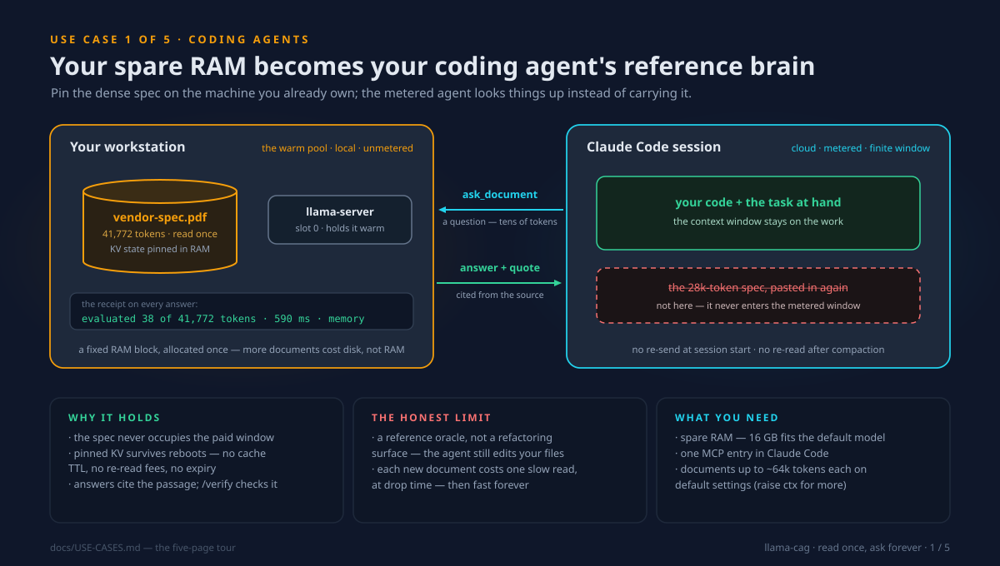
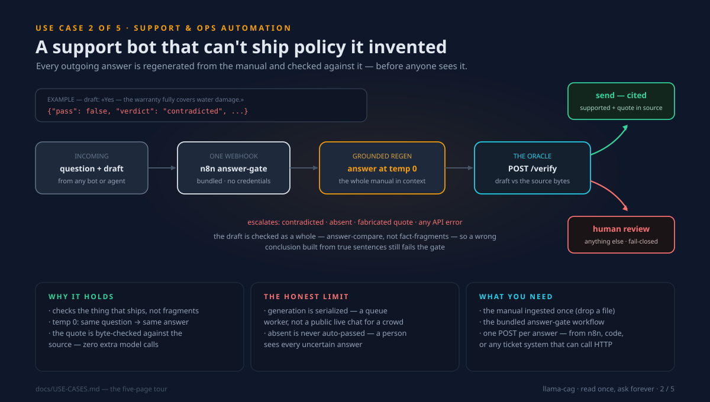
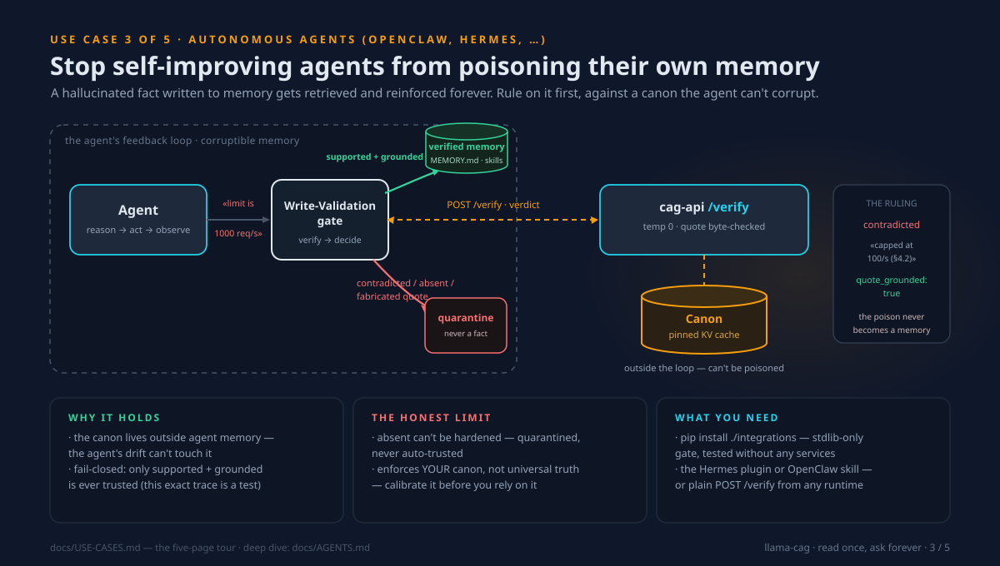
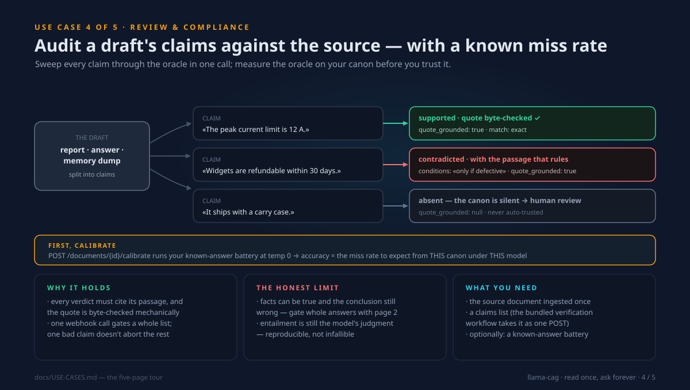
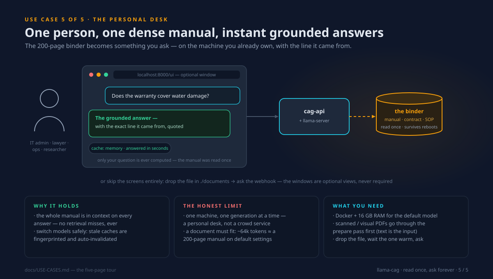

# Real-world use cases — the five-page tour

*One deployment per page. Everything on these pages ships in the repo today —
nothing here is roadmap. Each page says what the setup is, why it mechanically
holds, and — just as loudly — its honest limit. Numbers are the stack's real
defaults (Gemma 4 12B QAT, a 65,536-token window, one hot slot).*

Each image below is a self-contained 16:9 slide: open this file on GitHub to
flip through them, or print the page to PDF from your browser if you need a
literal deck to present.

| Page | You are… | The shape |
|---|---|---|
| [1. The spec sidecar](#1-the-spec-sidecar-for-your-coding-agent) | a developer with a coding agent | your spare RAM holds the spec; the paid agent asks it |
| [2. The answer gate](#2-the-answer-gate--support-that-cant-invent-policy) | running a support bot or ops automation | every outgoing answer is checked before it ships |
| [3. The agent memory gate](#3-the-grounding-gate-for-agent-memory) | running OpenClaw / Hermes / any long-lived agent | facts are ruled on before they become memories |
| [4. The claim audit](#4-the-claim-audit--batch-fact-checking-with-a-known-miss-rate) | reviewing drafts, reports, filings | every claim swept against the source, in one call |
| [5. The reference desk](#5-the-private-reference-desk) | one person with one dense binder | ask the manual instead of re-reading it |

---

## 1. The spec sidecar for your coding agent

  

**The situation.** Your coding agent needs a dense, unchanging reference — a
vendor API spec, a protocol document, an internal framework guide. Pasted into
the session it occupies a seventh of the context window, gets re-sent (and
re-billed) every fresh session, and gets re-read after every compaction.

**What actually happens here.** The machine under your desk — the one with RAM
to spare — reads the spec **once** and keeps its KV state pinned. Your agent
gets an MCP tool, [`ask_document`](../README.md#use-it-from-claude-code-mcp):
a question goes over (tens of tokens), a cited answer comes back. The receipt
on every answer shows what you didn't pay for:
`evaluated 38 of 41,772 prompt tokens`. This was always the natural way to run
CAG — a decent-RAM workstation as the always-warm answer pool beside the
metered agent. More documents cost **disk, never more RAM**: the pool is one
fixed block, allocated at startup
([resource anatomy](../README.md#resource-anatomy--what-uses-what-when)).

**The honest limit.** It's a reference oracle, not a refactoring surface — the
agent still opens your code files itself. And each *new* document costs one
slow read, at drop time, once.

**Run it:** [Use it from Claude Code](../README.md#use-it-from-claude-code-mcp) ·
[what it uses while running](../README.md#resource-anatomy--what-uses-what-when) ·
[hardware tiers](HARDWARE.md)

---

## 2. The answer gate — support that can't invent policy

  

**The situation.** A support bot built on a general model invents policy the
moment a question leaves the beaten path — and one confidently wrong refund
answer costs more than the bot ever saved.

**What actually happens here.** The draft answer is **regenerated** from the
manual at `temperature 0` — the model holds the *entire* manual in KV state —
and [`POST /verify`](../README.md#the-api) compares the draft against the
source, byte-checking the supporting quote mechanically. The bundled
[`answer-gate` workflow](../n8n/workflows/answer-gate-workflow.json) wraps this
in one webhook with the **fail-safe rule**: auto-pass *only* `supported` with a
grounded quote; contradicted, absent, a fabricated quote, or any API error all
route to a human. It checks the *answer that ships*, not fragments of it — so a
wrong conclusion assembled from true sentences still fails.

**The honest limit.** Generation is serialized: this is a queue worker (tickets,
emails, review batches), not a public live chat for a crowd. And `absent` never
auto-passes — a person sees every uncertain answer.

**Run it:** [gating a support bot's answers](../README.md#gating-a-support-bots-answers) ·
[the fail-safe rule](../README.md#the-grounding-oracle--check-any-ai-against-your-rulebook)

---

## 3. The grounding gate for agent memory

  

**The situation.** Long-lived agents (OpenClaw, Hermes Agent) improve by
*remembering* — and that is exactly how they rot. A hallucinated fact written
to `MEMORY.md` is retrieved and reinforced on every later task: errors in
evolving memory are **cumulative**. Checking the agent's memory using the
agent's own memory is circular; you need ground truth *outside* the loop.

**What actually happens here.** Your canonical document lives in the cag-api KV
cache — outside anything the agent can write to. Before a fact becomes a
memory, the [grounding gate](../integrations/) asks the canon:
`supported` with a byte-checked quote is stored; contradicted / absent /
fabricated-quote facts are **quarantined**. The poison never enters memory, so
it can never be retrieved and reinforced — and the compounding loop breaks at
the consolidation step. That exact trace (the 1000-vs-100 rate limit) runs as a
[test](../integrations/tests/test_gate.py) in CI.

**The honest limit.** `absent` can't be hardened — there's no passage to check —
so it's never auto-trusted. And the gate enforces *your canon*, not universal
truth: [calibrate it](../README.md#know-your-canons-reliability) before you
lean on it.

**Run it:** [docs/AGENTS.md](AGENTS.md) — the full design, drift mechanism, and
per-framework plumbing · [`integrations/`](../integrations/) — the tested gate,
the Hermes plugin, the OpenClaw skill

---

## 4. The claim audit — batch fact-checking with a known miss rate

  

**The situation.** A report, a filing, a marketing draft, an agent's memory
dump — a pile of factual claims that must agree with one source document, and
no one has time to hand-check each one against 200 pages.

**What actually happens here.** The bundled
[claim-verification workflow](../n8n/workflows/claim-verification-workflow.json)
takes the whole list in one POST and runs each claim through
[`POST /verify`](../README.md#the-api) at `temperature 0`: verdict, supporting
passage, any **conditions** the document places on the claim ("only if
defective"), and `quote_grounded` — the mechanical byte-check that catches a
fabricated citation with zero extra model calls. One bad claim is captured
without aborting the rest. And before you trust the oracle at all,
[**calibrate**](../README.md#know-your-canons-reliability) it: a known-answer
battery at `temperature 0` returns the accuracy — the miss rate to expect from
*this* canon under *this* model, measured, not assumed.

**The honest limit.** Facts can be individually true and the conclusion still
wrong — claim-by-claim auditing checks facts, not arguments (gate whole answers
with [page 2](#2-the-answer-gate--support-that-cant-invent-policy)). And
whether a real quote truly *entails* the claim is still the model's judgment —
reproducible, not infallible.

**Run it:** [the grounding oracle](../README.md#the-grounding-oracle--check-any-ai-against-your-rulebook) ·
[know your canon's reliability](../README.md#know-your-canons-reliability)

---

## 5. The private reference desk

  

**The situation.** One professional, one dense binder — a router manual, a
lease, an SOP folder, a thesis corpus — and the same questions over weeks. The
binder can't leave the building, and search only finds words, not answers.

**What actually happens here.** Drop the file in `./documents` (or upload it in
the [web UI](../README.md#quick-start)); the model reads it **once** — that's
the one slow moment, minutes on CPU — and from then on every question is
answered against the *entire* document in seconds, with the line it relied on.
The caches survive reboots. Switching models is safe: caches are fingerprinted
to the model that made them and stale ones are invalidated automatically —
the [v1 footgun](../README.md#what-its-for-and-what-to-expect--in-plain-words),
closed. The screens (web UI, desktop app) are optional windows; the folder and
the webhook are the real interface.

**The honest limit.** One machine, one generation at a time — a personal desk,
not a crowd service. A document must fit the budget: **~64k tokens ≈ a
200-page manual** on default settings (raise `LLAMA_CTX_SIZE` for more, up to
the model's 262k). Scanned or chart-heavy PDFs go through the
[prepare pass](../README.md#the-api) first — text is the input.

**Run it:** [setup guide](SETUP.md) ·
[plain-words explainer](EXPLAINER.md) ·
[is this for you?](../README.md#is-this-for-you)

---

*Where these numbers come from: the per-document budget is
`LLAMA_CTX_SIZE ÷ CAG_SLOTS − answer reserve − prompt overhead` — 64,416 tokens
on defaults. The receipt on page 1 is the worked example from the
[README's MCP session](../README.md#use-it-from-claude-code-mcp). The claims on
page 4 are the README's own oracle examples. Nothing on these pages is
projected or benchmarked-elsewhere; it's what the shipped code does.*
